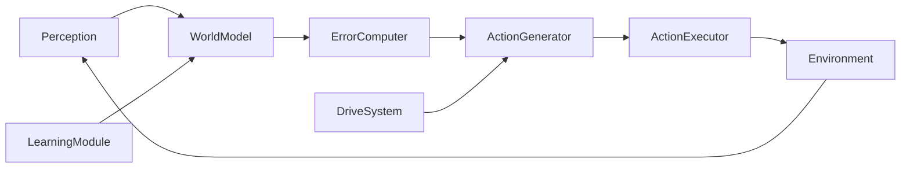
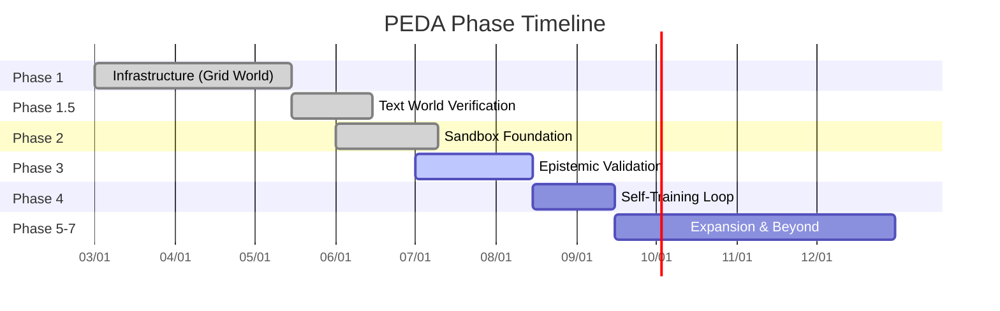

# PEDA — 预测误差驱动的自主 Agent

> Status: Phase 3 — Epistemic Validation（N=20 验证中）| GPU: T4 15GB

**中文导航**：[[PEDA 中文路线图]] | [[PEDA 研究动机]] | [[PEDA Reference Index]]

## What is PEDA?

PEDA 用**预测误差**替代用户指令来驱动 AI agent。核心假设：Agent 自己"想知道"下一步会发生什么，这种好奇心驱动它探索未知状态——这就是 epistemic exploration。

## Current State (2026-07-27)

| Phase | Status | Key Finding |
|-------|--------|-------------|
| Phase 1 — Grid World | DONE | 基础设施验证通过，但 5×5 Grid 太简单，WM 完美泛化 |
| Phase 2 — Sandbox | DONE (基础设施) | v2 沙箱 7 目录 14 文件，但 WM 不泛化（held-out L1=0.70-0.80） |
| Phase 3 — Epistemic | RUNNING N=20 | N=5 方向性信号：PEDA 6.8 步 vs Pragmatic 10.0 步（p=0.177），N=20 正在跑 |

### Phase Status Details

| Phase | Status | Episodes | Key Metric | Verdict |
|-------|--------|----------|------------|--------|
| Phase 1 — Grid World | DONE | N=10/condition | PEDA 3.3步 = Pragmatic 3.3步 (p=1.0) | 天花板效应，基础设施验证通过 |
| Phase 1.5 — Text World | DONE | N=20 | PEDA≠Pragmatic (decompose_error bug发现) | [[Phase 1.5 详细报告\|详见]] |
| Phase 2 — Sandbox | DONE | N=5 | Held-out L1=0.70-0.80 | WM不泛化v1→v2 [[Phase 2 详细报告\|详见]]|
| Phase 3 — Grid World (GPU) | DONE | N=10 | goal_known 3.3步/3.3步(p=1.0), goal_unknown 2.6步/2.6步(p=1.0) | **CORE_HYPOTHESIS_NOT_SUPPORTED** 天花板效应 |
| Phase 3 — Sandbox N=5 | DONE | N=5 | 方向性：PEDA未知6.8步 vs Pragmatic 10.0步(p=0.177) | N太小，统计不显著 |
| Phase 3 — Sandbox N=20 | RUNNING | N=20 | 进行中 | 等待完整数据 |

## Architecture

PEDA 包含 7 个模块的闭合循环：

- [[PEDA Architecture - World Model]] — LLM + LoRA，预测三层次（exit code / filesystem delta / output summary）
- [[PEDA Architecture - Drive System]] — 四维驱动（curiosity / competence / boredom / novelty）调制 EFE
- [[PEDA Architecture - Learning Module]] — 间歇式批量训练，防止灾难性遗忘

完整架构细节见 [[PEDA 完整架构详解]]。

## Phase 3 Grid World GPU 结果

`results/phase3_gpu/report.json` (95行，N=10/condition) 显示完整的**天花板效应**：

| Condition | PEDA steps | Pragmatic steps | p-value |
|-----------|-----------|-----------------|---------|
| goal_known | 3.3 ± 1.35 | 3.3 ± 1.35 | p=1.0 (公平性检验通过) |
| goal_unknown | 2.6 ± 1.85 | 2.6 ± 1.85 | p=1.0 (MW检验) |

两者完全一致（连标准差都相同），说明在 Grid World 上 PEDA 和纯 pragmatic 策略等价。验证结论：**CORE_HYPOTHESIS_NOT_SUPPORTED**（3/7 success criteria passed）。

参见：[[Phase 3 Grid World]] — 天花板效应 #1，[[AWS GPU 使用指南]] — GPU 实验配置

> [!danger] 天花板效应确认
> Grid World 上 PEDA = Pragmatic (p=1.0) — 0.5B 模型在 5×5 棋盘上 100% 泛化，epistemic error = 0。核心假设在此条件下不成立。详见 [[Phase 1 详细报告]]。
>
> 但 Sandbox N=5 显示方向性信号：PEDA 未知 6.8 步 vs Pragmatic 10.0 步 (p=0.177)。N=20 运行中。
>
## Phase 3 Sandbox N=5 方向性信号

`results/phase3_sandbox/` (4文件，各5 episodes)：

| Condition | PEDA mean steps | Pragmatic mean steps | p-value |
|-----------|----------------|---------------------|---------|
| goal_known | 4.6 | 4.6（pragmatic_known不可得，见下） | — |
| goal_unknown | **6.8** (10,2,10,10,2) | **10.0** (10,10,10,10,10) | p=0.177 (MW) |

未知条件方向性信号：PEDA 在 5 次中有 2 次 2 步完成任务（直接找到目标文件），而 Pragmatic 全部走了 10 步上限 + 80% dead loop rate。p=0.177 未达显著性，但所有效应方向一致。

## Key Decisions

- [[Data Quality over Quantity]] — e2 (200 curated) > e3 (10k random)
- [[WM as Pattern Matcher]] — 0.5B + LoRA 不推理，只做 (s,a)→result 查表
- [[Phase Restructure v2.0]] — 从 4 阶段到 7 阶段重组

## Experimental Results

- [[Phase 1 Grid World]] — 基础设施 work，core hypothesis 无法测试（天花板）
- [[Phase 2 Sandbox - Held-Out]] — e2 adapter v1→v2 泛化失败
- [[Phase 3 Grid World]] — 天花板效应 #1，PEDA=Pragmatic
- [[Phase 3 Sandbox N=5]] — 方向性信号，N 太小
- [[Phase 3 Sandbox N=20]] — 进行中

## Seven Phases (v2.0)

| # | Phase | Substance |
|---|-------|-----------|
| 1 | Infrastructure | Code can run |
| 2 | Sandbox Foundation | Environment exists |
| 3 | **Epistemic Validation** | **Does the core mechanism work?** |
| 4 | Self-Training Loop | LearningModule closed loop |
| 5 | Sandbox Expansion | v3 write → v4 Python → v5 network |
| 6 | Knowledge→Application | Self-generated goals |
| 7 | Self-Modification | Agent chooses what to learn |

## WATCHDOG Compliance

项目维护 [[WATCHDOG.md]] (1029行) 作为守护规则。当前各 Blocker 状态：

| Rule | Status | Notes |
|------|--------|-------|
| B1 — Phase advancement | COMPLIANT | 当前 Phase 3 正在运行 N=20 验证，无提前推进 |
| B2 — Fabricating uncertainty | COMPLIANT | 所有 stub 保持确定性 |
| B3 — Module review gate | COMPLIANT | 核心模块保持在 5 个以内 |
| B4 — New PLAN docs [→Concern] | COMPLIANT | 未创建新计划文档 |
| B5 — Sample size | COMPLIANT | N=5 标记为方向性，N=10 用于确认 |
| B6 — Cherry-picking | COMPLIANT | 所有条件预注册，负结果已报告 |
| B7 — Env-model mismatch [→Concern] | COMPLIANT | Grid World 天花板效应已接受并 pivot |
| B8 — Death spiral | COMPLIANT | 参数调整 ≤2 次即 pivot |
| B9 — Unexplained anomalies | COMPLIANT | Phase 1.5 decompose_error 已定位并修复 |

## Resources

- Repo: `~/Projects/Folunar_/`
- Source: `src/phase2/run.py` — full PEDA loop (Phase 2)
- Best adapter: `checkpoints/phase2/sandbox_adapter_v2_full/` (v2 sandbox, 65 transitions)
- GPU: AWS g4dn.xlarge (T4 15GB), instance `i-0cbdb085a1e726bef`
- [[PEDA 完整架构详解]] — 7 模块架构详细设计
- [[PEDA 实验方法论]] — 实验设计、数据收集、分析方法
- [[PEDA 开发规则]] — 编码规范与工作流
- [[PEDA 术语表]] — 关键概念定义
- [[AWS GPU 使用指南]] — GPU 实例配置与实验运行
- [[Phase 1 详细报告]] — Phase 1 Grid World 完整报告
- [[Phase 1.5 详细报告]] — Phase 1.5 Text World 分析
- [[Phase 2 详细报告]] — Phase 2 Sandbox 完整报告
