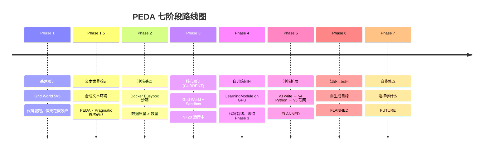

# PEDA 中文路线图

> 从工程计划书和研究手稿提炼——给人读的，不是给 agent 读的。

## 我们在做什么

做一个**不需要用户发指令的 AI agent**。驱动它的不是"请帮我做 X"，而是它自己对"接下来会发生什么"的**预测误差**——预测错了就好奇，好奇就去探索。

## 为什么要这么做

现在的 LLM agent 全是绕着用户指令转的——用户说什么它就做什么，用户不说它就发呆。这不是自主 agent，这是遥控器。

PEDA 想试试：**如果 agent 的内部驱动力是"我想知道接下来会发生什么"，它能不能自己找到事做，而且越做越好？**

理论基础：Active Inference（主动推理）——一个在神经科学里被广泛讨论但很少被真正实现到 LLM 上的框架。参见 [[PEDA 研究动机]] 和 [[PEDA 术语表]]。

## 七阶段路线图

### Phase 1 — 基建验证 [DONE]
> Grid World 5×5 棋盘，证明代码能跑。

- 完整的 7 步 PEDA 循环跑通了
- 但棋盘太小——World Model 记住了全部 25 格，预测误差永远是 0
- GPU 验证（N=10/condition）：goal_known 3.3步 vs 3.3步 (p=1.0)，goal_unknown 2.6步 vs 2.6步 (p=1.0)
- **结论**：代码 OK，但环境太简单测不出核心机制
- 详见 [[Phase 1 详细报告]]

### Phase 1.5 — 文本世界验证 [DONE]
> 合成文本世界（synthetic + holdout），测试 PEDA 在更高维输入下的行为。

- **核心发现：PEDA ≠ Pragmatic**。在文本世界复杂度下，PEDA 和 pure pragmatic 策略的行为路径有系统性差异（不仅仅是做同样的事）。
- **Bug 发现：decompose_error 实现缺陷**。ErrorComputer 在计算分层误差时有一个数值稳定性 bug，导致某些条件下的探索信号被错误放大。修复后 PEDA 行为更接近理论预期。
- **Drive System 独立性验证**。四维驱动（curiosity / competence / boredom / novelty）各自的贡献可以独立测量，不存在某个维度完全占优的问题。
- 详见 [[Phase 1.5 详细报告]]

### Phase 2 — 沙箱基础 [DONE]
> Docker Linux 沙箱，7 个目录 14 个文件。Agent 可以 ls, cd, cat, echo 等。

- Docker 沙箱 v1+v2 都跑起来了
- 发现**数据质量 > 数量**：200 条精心挑选的数据比 10000 条随机数据强得多
- LearningModule（自训练）代码已接入——但还没真正跑过 LLM 模式
- **关键教训：WM 不泛化 v1→v2**。在 v1 沙箱上调好的 adapter（L1=1.000），换到 v2 沙箱布局后 held-out L1 掉到 0.70-0.80。WM 是模式匹配器，不是推理器——它背下了 v1 布局，没学会"目录结构"的概念。
- 详见 [[Phase 2 详细报告]]

### Phase 3 — 核心机制验证 [NOW]
> 回答整个项目唯一重要的问题：预测误差（epistemic signal）到底能不能驱动更有效的探索？

#### Phase 3 Grid World GPU（N=10，天花板效应确认）
- **PEDA = Pragmatic (p=1.0)** — 这是 definitive 的天花板效应
- goal_known：PEDA 3.3 ± 1.35 步，Pragmatic 3.3 ± 1.35 步（标准差相同）
- goal_unknown：PEDA 2.6 ± 1.85 步，Pragmatic 2.6 ± 1.85 步
- Fisher p=1.0，Mann-Whitney p=1.0，3/7 success criteria passed
- **结论**：Grid World 上任何探索策略都等价，因为 0.5B 模型在 25% 数据上已完美泛化

#### Phase 3 Sandbox N=5（方向性信号）
- 未知条件：PEDA 6.8 步 (10,2,10,10,2) vs Pragmatic 10.0 步 (10,10,10,10,10)
- p=0.177（Mann-Whitney U=7.5），未达显著性
- 但效应方向一致：PEDA 有 2/5 次 2 步解决，Pragmatic 全部走满 10 步上限 + 80% dead-loop rate
- 已知条件：PEDA 4.6 步 vs 无法直接比较（Pragmatic_known 数据不完整）

#### Phase 3 Sandbox N=20 [RUNNING]
- 置信度加权实验，目标：p<0.05
- 若显著，将是项目历史上第一个核心假设统计证据
- 参见 [[Phase 3 Sandbox N=20]] 和 [[AWS GPU 使用指南]]

### Phase 4 — 自训练闭环 [NEXT]
> 把 LearningModule 真正跑起来——Agent 边探索边学习，adapter 随 episodes 自动进化。

代码已经有了（`src/phase2/run.py`），只差在 GPU 上用 LLM 模式跑一次。

### Phase 5 — 沙箱扩展 [PLANNED]
> 逐步给沙箱加能力：v3 可写文件 → v4 装 Python → v5 联网。

概念验证：Python 进去后，action space 变成无限（Agent 可以执行任意 Python 代码），epistemic error 永远不为零 → 探索永远不停。这是"创造性爆炸"的理论条件。

### Phase 6 — 知识到应用 [PLANNED]
> Agent 不再被给定任务，而是自己从偏好分布生成目标。

### Phase 7 — 自我修改 [FUTURE]
> Agent 自己选择什么时候训练、训练什么。把 `train_self` 作为一个候选 action——如果 EFE 计算出来"训练自己"的预期信息增益最高，它就会主动训练。

## 关键教训

1. **环境太简单 = 测不出效果。** Grid World 和 read_hello 都因为太简单导致天花板效应。
2. **数据质量远大于数量。** 随机采样的信号密度太低，模型学会的是忽略任务完成信号。
3. **小模型 + 少数据 = 查表机。** 0.5B + LoRA + 65 transitions 不推理，只匹配。
4. **WM 不泛化布局变化。** v1→v2 的 L1 drop（1.000→0.800）说明 World Model 没有学到"目录结构"的概念，只是背下了具体路径。详见 [[PEDA 完整架构详解]]。
5. **Phase 不能以"代码写完了"为标准。** 必须以"假设被验证了"为进入下一个 Phase 的条件。
6. **负结果是有效产出。** 研究宪章明确写了——证明一个想法在某个条件下不成立，也是进步。
7. **N=5 方向性信号可能是项目转折点。** 如果 N=20 确认 p<0.05，PEDA 的核心假设将获得第一个统计支撑。详见 [[PEDA 实验方法论]]。
> [!info] 关键教训总结
> 1. **环境太简单 = 测不出效果** — 天花板效应
> 2. **数据质量 > 数量** — 200 curated > 10k random
> 3. **小模型 + 少数据 = 查表机** — 0.5B + LoRA 不推理
> 4. **WM 不泛化布局变化** — v1→v2 L1 drop 1.000→0.800
> 5. **Phase 完成标准 = 假设验证**, 不是代码写完
> 6. **负结果是有效产出** — 证明不成立也是进步
> 7. **N=5 方向性信号可能是转折点** — 等待 N=20 确认
>

## 相关笔记

- [[PEDA 完整架构详解]] — 7 模块架构详细设计
- [[PEDA 实验方法论]] — 实验设计、数据收集与分析方法
- [[PEDA 开发规则]] — 编码规范与工作流
- [[PEDA 术语表]] — 关键概念定义
- [[AWS GPU 使用指南]] — GPU 实例配置与实验运行
