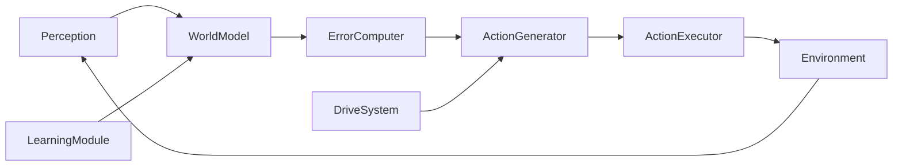
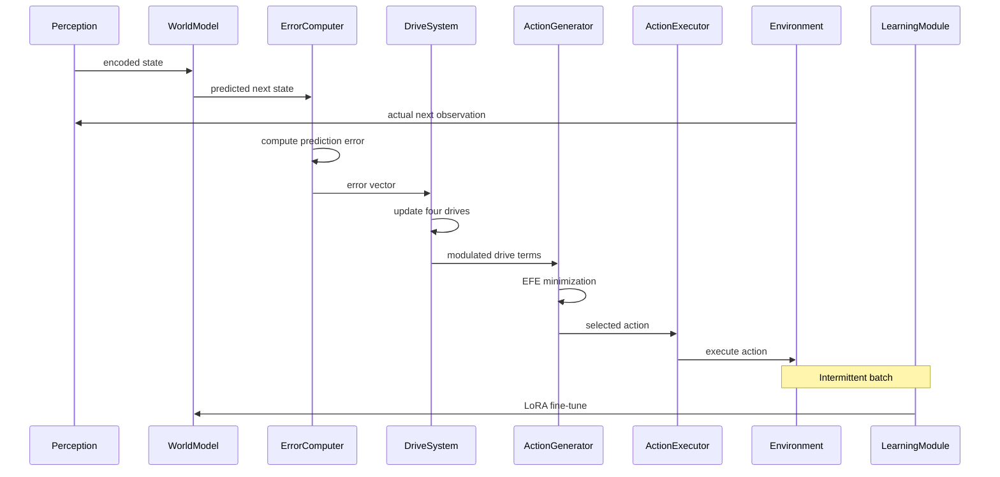

# PEDA 完整架构详解

> 7 模块闭合循环：预测误差驱动探索的完整实现

## 架构总览

PEDA 的核心循环包含 7 个模块，形成一个闭环数据流：



**数据流**：
1. **Perception** → JSON 结构化状态
2. **WorldModel** → 三层次预测（L1/L2/L3）
3. **ErrorComputer** → epstemic/aleatoric 分解
4. **DriveSystem** → 四维驱动项更新
5. **ActionGenerator** → EFE 最小化选动作
6. **ActionExecutor** → Docker 沙箱执行
7. **LearningModule** → 间歇式批量训练，更新 WorldModel

[INFERENCE] 数据流由 `src/phase2/run.py:run_peda_episode()` 的实现逻辑推导，非单篇规范文档定义。



---

## 1. Perception 模块

### GridState (`src/phase1/types.py:7-16`)
Phase 1 的感知状态，用于 5×5 Grid World：

```python
@dataclass
class GridState:
    agent: Tuple[int, int]
    goal: Tuple[int, int]
    obstacles: List[Tuple[int, int]] = field(default_factory=list)
    width: int = 5
    height: int = 5
    step: int = 0
    max_steps: int = 50
```

**渲染**：`Perception.render()` (`src/phase1/grid_env.py:130-136`) → 纯文本描述 `"Agent at (x,y). Goal at (gx,gy). Obstacles at ..."`

### SandboxState (`src/phase2/sandbox_env.py:29-66`)
Phase 2 的感知状态，用于 Docker Busybox 沙箱：

```python
@dataclass
class SandboxState:
    container_id: str = ""
    cwd: str = "/sandbox"
    last_command: str = ""
    last_output: str = ""
    last_exit_code: int = 0
    files: List[str] = field(default_factory=list)
    step_count: int = 0
    max_steps: int = 20
    victory: bool = False
    game_over: bool = False
```

**渲染**：`SandboxState.to_json()` (`src/phase2/sandbox_env.py:42-52`) → JSON 结构化输出，包含 `cwd`、`files`、`last_command`、`last_exit_code`、`last_output`、`step`、`victory`、`game_over`

**关键差异**：GridState 是位置+目标的元组对，SandboxState 是 JSON 文件系统快照。`Perception.render_text()` (`src/phase1/grid_env.py:157-167`) 通过 `hasattr(state, "container_id")` 动态分发两种渲染路径。

---

## 2. World Model (`src/phase1/world_model.py:30-695`)

PEDA 的核心引擎。基座模型 **Qwen2.5-0.5B-Instruct**，通过 **LoRA** 适配。默认尝试 1.5B，fallback 到 0.5B，emergency 到 Phi-3-mini（`world_model.py:32-34`）。

### LoRA 配置 (`world_model.py:69-76`)

```python
self._lora_config = LoraConfig(
    r=lora_r,          # rank=16 (default, overridable)
    lora_alpha=lora_alpha,  # alpha=32 (default)
    target_modules="all-linear",
    lora_dropout=lora_dropout,  # 0.05
    bias="none",
    task_type="CAUSAL_LM",
)
```

实际使用中 rank=8, alpha=16（Phase 2 训练配置）。

### 三层次预测

| Level | 预测内容 | 目标 | v2_full 实测 |
|-------|---------|------|-------------|
| L1 | exit code（0=成功/移动, 1=失败/撞墙, 2=任务完成） | >= 0.90 | 0.70-0.80 |
| L2 | filesystem delta（哪些文件变了，Grid World 则是下一个位置） | >= 0.70 | 0.686 |
| L3 | output summary（语义匹配） | >= 0.50 | 0.229 |

**L1/L2/L3 held-out 实测**（来自 `results/phase2_remaining/l1l2l3_heldout.json`）：
- L1 = 0.800（e2 adapter 在 v2 沙箱 OOD 目录上），目标 0.90 — FAIL
- L2 = 0.686，目标 0.70 — FAIL
- L3 = 0.229，目标 0.50 — FAIL
- 测试集：35 个 OOD (state, action) pair，目录含 `logs/`、`projects/`、`README.txt` 等 e2 未见过的布局

### 预测路径

`WorldModel.predict()` → `_llm_predict()` (`world_model.py:292-364`):
- **SanboxState 路径**：生成 JSON 预测 (`cwd`, `files`, `last_command`, `last_exit_code`, `last_output`) → 构建 `PredictedState` 含 `level2_text` JSON 字符串
- **GridState 路径**：生成 `(next_position, exit_code, summary)` → 位置元组

`PredictedState` (`src/phase1/types.py:24-33`)：
```python
@dataclass
class PredictedState:
    level1_exit_code: int
    level1_confidence: float
    level2_next_agent: Tuple[int, int]
    level2_confidence: float
    level3_output_summary: str
    level3_confidence: float
    epistemic_ratio: float = 0.5
    level2_text: str = ""
```

`epistemic_ratio` 用于 EFE 计算，在 LLM 模式下为 `1.0 - confidence`（单一模型时作为 epistemic 代理）。

### 冷启动与延迟

- **冷启动**：~176s CPU（加载模型 + tokenizer）
- **单步预测**：~3s/call CPU
- **GPU+Docker**：~18s/step（含 Docker 网络开销，AWS g4dn.xlarge T4 15GB）
- **FAST 模式**（`WorldModel._stub_predict()`）：确定性规则引擎，用于测试和开发

### 训练数据

| Adapter | 数据量 | 来源 | 特征 |
|---------|--------|------|------|
| e1 | 200 transitions | 5 tasks × 20 steps random + 5 tasks × 20 steps heuristic | v1 沙箱 4 目录 |
| e2 | 200 curated | 同上 + exit_code=2 任务完成标记 | v1 沙箱，含 6 条完成样本 |
| sandbox_v2_full | **65 条系统性过渡** | 手动遍历 v2 沙箱 21 个目录/文件 | v2 沙箱 7 目录、14 文件 |
| e3 | 10,040 transitions | v2 扩量 + 合成数据（CPU-only 超时，未完全验证） | v2 沙箱 |

**e2 训练损失**（来自 `PEDA_WORKING_LOG.md:208`）：3 epochs，loss 0.4424 → 0.0291 → 0.0030 → 0.0001

### 模式匹配器局限

0.5B + LoRA 在 65-200 条数据上退化为主存查表器——不是推理器。见 [[WM as Pattern Matcher]]。关键证据：held-out L1=0.800，即遇到未见过的目录布局就失败。

---

## 3. ErrorComputer (`src/phase1/world_model.py:697-857`)

### EnsembleErrorComputer

**核心功能**：通过多个 LoRA checkpoint 的 ensemble 方差分解 epistemic/aleatoric uncertainty。

```python
class EnsembleErrorComputer:
    def __init__(self, world_model: WorldModel, num_checkpoints: int = 5):
        self.checkpoints: List[Path] = []
```

### 工作原理

1. `save_checkpoint(step)` → 保存当前 LoRA adapter → 维护最多 `num_checkpoints` 个 checkpoint 的滑动窗口
2. `decompose_error(state, action, actual)` → 核心方法：
   - 用每个 checkpoint 独立预测 → 得到 `List[PredictedState]`
   - 计算 **level1_error**：exit code 预测的多数投票错误率
   - 计算 **level2_error**：对于 SandboxState，用 files Jaccard 距离（`world_model.py:749-752`）
   - 计算 **ensemble_variance**：checkpoint 间的不一致性（pairwise 平均分歧，`world_model.py:755-763`）
   - `epistemic_error = ensemble_variance`
   - `aleatoric_error = max(0.0, mean_deviation - ensemble_variance)`

### Epistemic vs Aleatoric 直觉

| 类型 | 含义 | ensemble 表现 | 处理 |
|------|------|-------------|------|
| **Epistemic**（认知不确定性） | 模型不知道，因为还没见过 | 5 个 checkpoint 预测不一致 | → curiosity 驱动探索 |
| **Aleatoric**（偶然不确定性） | 环境本身随机，模型也猜不对 | 5 个 checkpoint 一致同意，但结果和预测不一样 | → competence 驱动利用 |

**实现机制**：`ensemble_variance` 计算公式（`world_model.py:755-763`）对所有 checkpoint pair 计算 exit code + files 的归一化分歧，再除以 2（最大可能分歧）。

### ErrorVector (`src/phase1/types.py:37-44`)

```python
@dataclass
class ErrorVector:
    total_error: float
    level1_error: float
    level2_error: float
    level3_error: float
    epistemic_error: float
    aleatoric_error: float
    ensemble_variance: float
```

---

## 4. ActionGenerator (`src/phase1/drive_system.py:115-246`)

### EFE 最小化

EFE = Expected Free Energy。ActionGenerator 选择 **EFE 最小** 的动作：

```python
efe = self.compute_efe(state, trajectory, action_history, candidate_action)
```

### EFE 组成

```
ground_efe = epistemic + pragmatic × pragmatic_weight
drive_adjustment = Σ(weight × term × modulation)
final_efe = ground_efe - drive_adjustment
```

- **epistemic**：轨迹中各步的 `(1 - level2_confidence) × epistemic_ratio × discount`（`drive_system.py:187-189`）
- **pragmatic**：任务完成信号（exit_code=2 时为 0，否则 0.5，`drive_system.py:159-183`）
- **pragmatic_only 模式**：跳过 epistemic 和驱动，只用 pragmatic（纯利用基线）

### ConfidencePenalty（`drive_system.py:192-195`）

当预测置信度平均 > 0.95 时，对 EFE 加额外惩罚 0.3 × (avg_conf - 0.95)。防止 agent 因 WM 过度自信陷入死循环。

### Graceful Degradation

- `horizon`：默认 2，当 `latency_budget_ms` 不足时降为 1
- `max_candidates`：默认 4，CPU 模式下降为 2-3
- 当 `best_action is None` 时，从候选随机选一个

### 网格搜索结果

来自 `results/phase1_grid_search.json`：Pareto 前 5 权重组合：

| rank | curiosity | competence | boredom | novelty | score | revisits |
|------|-----------|-----------|---------|---------|-------|----------|
| 1 | **1.0** | **0.1** | **0.1** | **2.0** | 0.9796 | 0.02 |
| 2 | 2.0 | 1.0 | 0.5 | 1.0 | 0.9796 | 0.025 |
| 3 | 2.0 | 0.1 | 0.5 | 2.0 | 0.9704 | 0.05 |
| 4 | 0.5 | 0.5 | 0.5 | 0.5 | 0.9776 | 0.025 |
| 5 | 1.0 | 2.0 | 0.5 | 0.5 | 0.9764 | 0.025 |

**最佳权重**：curiosity=1.0, competence=0.1, boredom=0.1, novelty=2.0（最低 revisit rate 0.02）

---

## 5. ActionExecutor (`src/phase2/sandbox_env.py:97-201`)

### BusyboxSandbox

Docker 沙箱执行器，提供安全隔离的 Linux 环境：

```python
class BusyboxSandbox:
    def __init__(self, image: str = DOCKER_IMAGE):
```

### 安全策略

**白名单命令**（`sandbox_env.py:16`）：
```python
WHITELIST = {"ls", "cd", "cat", "echo", "mkdir", "touch", "pwd", "wc", "head", "tail", "grep", "find"}
```

**黑名单模式**（`sandbox_env.py:17-23`）：
```python
BLOCKLIST_PATTERNS = [
    re.compile(r"\brm\b"), re.compile(r"\bmv\b"), re.compile(r"\bcp\b"),
    re.compile(r"\bchmod\b"), re.compile(r"\bchown\b"), re.compile(r"\bdd\b"),
    re.compile(r"\bmkfs\b"), re.compile(r"\bmount\b"), re.compile(r"\bsudo\b"),
    re.compile(r"\bsu\b"), re.compile(r"\bdocker\b"), re.compile(r"\bkill\b"),
    re.compile(r"\bshutdown\b"), re.compile(r"\breboot\b"),
]
```

**Docker 安全标志**（`sandbox_env.py:107-109`）：
```
docker run -d --rm \
  --cap-drop=ALL \
  --read-only --tmpfs /tmp \
  --network none
```

- `--cap-drop=ALL`：移除所有 Linux capabilities
- `--read-only`：根文件系统只读（仅 `/tmp` 可写）
- `--network none`：无网络连接

### 验证流程

1. `_validate_command(command)`（`sandbox_env.py:69-80`）→ 先检查白名单，再扫黑名单
2. `step(state, action)`（`sandbox_env.py:137-188`）→ `docker exec` 执行命令，捕获 stdout/stderr，更新 `last_output`（最多 500 字符）
3. 自动处理 `cd` 更新 `cwd`，且刷新文件列表

---

## 6. LearningModule

### 架构层次

| 层 | 文件 | 类 | 功能 |
|---|------|---|------|
| 基类 | `src/phase1/world_model.py:920-966` | `LearningModule` | 通用间歇式批量训练 |
| 子类 | `src/phase2/run.py:13-60` | `SandboxLearningModule` | SandboxState 适配 |

### LearningModule (`world_model.py:920-966`)

```python
class LearningModule:
    def __init__(self, world_model, error_computer, buffer_size=1000, update_interval=500):
        self.buffer = ExperienceBuffer(max_size=buffer_size)
        self.update_interval = update_interval
        self.saturation_detector = SaturationDetector(window_size=100)

    def store_experience(self, experience): ...
    def should_update(self): return len(self.buffer) >= self.update_interval

    def update(self):
        samples = self.buffer.sample_prioritized(batch_size=64)
        # → lora_finetune(data, epochs=1, learning_rate=2e-4, batch_size=4)
        # → save_checkpoint()
        # → buffer.clear()
```

### SandboxLearningModule (`src/phase2/run.py:13-60`)

关键差异：
- 用 `hasattr(exp.state, "container_id")` 动态分发 SandboxState → `state.to_json()` vs GridState → `Perception.render()`
- 用 `exp.state.to_json()` 替代 `Perception.render()` 
- 使用 `isinstance`/duck-typing 同时支持 Phase 1 GridState 和 Phase 2 SandboxState

### SaturationDetector (`world_model.py:859-882`)

```python
class SaturationDetector:
    def __init__(self, window_size: int = 100):
    def is_saturated(self) -> bool:
        # 比较窗口前一半和后一半的 mean total_error
        # 若 decline < 15% → 饱和
    @property
    def novelty_boost(self) -> float:
        return 0.5 if self.is_saturated() else 0.0
```

### 优先级采样 (`world_model.py:901-917`)

```python
def priority_fn(exp: Experience) -> float:
    return exp.error.epistemic_error  # 默认按 epistemic_error 采样
```

确保高 epistemic error 的 experience 更可能被回放。

### 缓存参数

- `buffer_size`：1000（LearningModule 默认）
- `update_interval`：500（LearningModule 默认），测试模式下 50
- `batch_size`：64（采样），4（训练）
- `batch_size`：64（采样），4（训练）
- 当前 Phase 3 中未启用（LLM 模式需 GPU，CPU-only 训练超时）

---

## 7. DriveSystem (`src/phase1/drive_system.py:42-112`)

HomeostaticDriveSystem：四维内稳态驱动，调制 EFE 计算。

### 四维驱动

| Drive | 计算公式 | 范围 | 效果 |
|-------|---------|------|------|
| **Curiosity** | `tanh(2.0 × epistemic_error)` | [0, 1) | 高 epistemic → 探索 |
| **Competence** | `flow_zone(success_rate)` | [0.2, 0.8] | 成功率在 20-80% 时最高 |
| **Boredom** | `max(0, 0.7 - entropy)` | [0, 0.7] | 动作多样性低 → 惩罚 |
| **Novelty** | `1 - exp(-0.01 × steps_since_external)` | [0, 1) | 长时间无新状态 → 奖励 |

### DriveTerm 应用（`apply_to_efe`）

```python
drive_adjustment = (
    weights.curiosity × current_terms.curiosity × info_gain
    + weights.competence × current_terms.competence × challenge_level
    + weights.boredom × current_terms.boredom × diversity_bonus
    + weights.novelty × current_terms.novelty × external_info_potential
)
final_efe = base_efe - drive_adjustment
```

### 关键发现（Phase 1.5）

**Drive System 在 epistemic≈0 时仍有独立价值。** 在 TextWorld 实验中，即使 World Model 没有 epistemic uncertainty（环境被完美记忆），boredom + competence 也能驱散 `look` 死循环。说明驱动系统不是 epistemic 的附庸——它在 EFE 框架中独立贡献探索行为。

---

## 数据流详解

```
每步循环:
  1. Perception: 环境 → GridState/SandboxState JSON
  2. WorldModel.predict(state, action) → PredictedState (L1/L2/L3)
  3. ErrorComputer.decompose_error(state, action, actual_state) → ErrorVector
     ├─ level1_error, level2_error, level3_error
     ├─ epistemic_error (ensemble variance)
     └─ aleatoric_error (mean_deviation - ensemble_variance)
  4. DriveSystem.update(error, last_action, ...) → DriveTerms
  5. ActionGenerator.compute_efe(trajectory) → EFE (含 confidence_penalty + drive_adjustment)
  6. ActionGenerator.select_action(candidates) → 最小 EFE 的动作
  7. ActionExecutor.step(action) → docker exec → new State
  8. LearningModule.store_experience(Experience(state, action, next_state, error))
     └─ 当 buffer >= update_interval → lora_finetune → save_checkpoint → clear
```

---

## 参见

- [[PEDA Architecture - World Model]] — WM 详细配置与训练
- [[PEDA Architecture - Drive System]] — 驱动系统参数与实验
- [[PEDA Architecture - Learning Module]] — 间歇式训练实现
- [[PEDA 实验方法论]] — 实验设计与评价
- [[Phase 2 Sandbox - Held-Out]] — v2 沙箱 held-out 结果
- [[Phase 3 Sandbox N=5]] — N=5 方向性信号
- [[WM as Pattern Matcher]] — WM 局限性的理论分析
- [[Data Quality over Quantity]] — 训练数据策略
