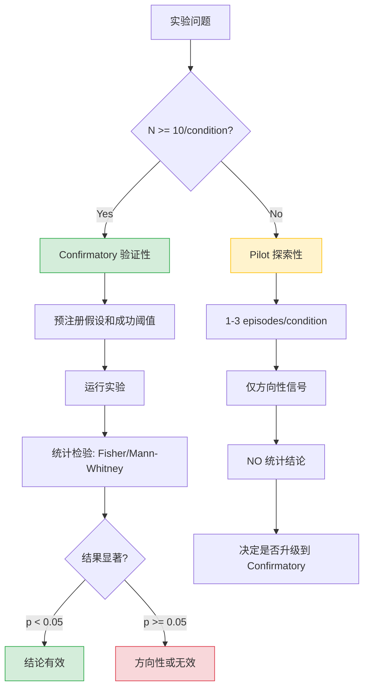

# PEDA 实验方法论

> 实验设计、统计标准、决策框架的系统化指南。来源：[[PEDA Reference Index]] `WATCHDOG.md`、`PEDA_ENGINEERING_PLAN_v2.md` §3.1、`RESEARCH_CHARTER.md`、`PHASE1_PARTIAL_EVALUATION.md`。

## 1. Pilot vs Confirmatory 区分

**Pilot（探索性实验）**：1-3 episodes/condition，仅用于发现效应是否可能存在。结果方向性，不可作为统计结论。`WATCHDOG.md#B5` 明确禁止将 pilot 结果当作"验证"。

**Confirmatory（验证性实验）**：>=10 episodes/condition，用于检验预先注册的假设，使用预先定义的成功阈值。统计检验（Fisher exact, Mann-Whitney U）仅在 confirmatory 阶段有效。

**NEVER 混用二者**：Pilot 结果再强烈也不能替代 confirmatory 实验。Phase 1 partial-training pilot 中 PEDA 2 步 vs Pragmatic 20 步表现出强烈差异，但只有 N=1，无法排除运气（`PHASE1_PARTIAL_EVALUATION.md` §4.2 解释 B）。

## 2. 统计标准

| 参数 | 值 | 来源 |
|------|-----|------|
| 显著性水平（α） | 0.05 | `PHASE1_PARTIAL_EVALUATION.md` §6.2 |
| 统计功效（1-β） | 0.80 | 同上 |
| 成功率检验 | Fisher exact test | 同上 |
| 步数检验 | Mann-Whitney U test | 同上 |
| 最小 episode 量 | 10/condition | `WATCHDOG.md#B5` |

效应量估计来自 pilot 数据。Phase 1 的 pilot 显示 80% vs 20% 的成功率差异（大效应），据此算出每组需要约 8-10 episodes。如果真实效应更小（如 60% vs 20%），需要 15-20 episodes（`PHASE1_PARTIAL_EVALUATION.md` §6.2）。

## 3. 预注册协议

`WATCHDOG.md#B6` 要求：在运行实验前，记录实验条件（train_fraction、grid size、episode count、成功阈值）在评估脚本或简短协议备注中。

**条件变更规则**：如果必须调整参数（如 g1_test_set 太高需要降低 train_fraction），必须：
1. 记录变更原因
2. **重新运行所有条件**——不能选择性重跑原本不利的条件
3. 报告所有结果，包括 null 和负结果

## 4. 负结果接受原则

来自 `RESEARCH_CHARTER.md`：负结果不是项目失败，而是知识。

| 负结果 | 科学价值 |
|--------|---------|
| LLM 无法产生可区分的 epistemic 信号 | 说明当前模型规模/微调方法不足以支持 FEP |
| EFE 在 horizon=2-3 时退化为贪心 | 说明 Active Inference 需要特定硬件条件 |
| 预测误差驱动不如纯 pragmatic | 说明 FEP 的 epistemic value 在某些环境中不如 pragmatic |
| 冷启动无法解决 | 说明 bootstrap 策略或模型先验知识不足 |
| **任何 Phase 失败** | 说明 PEDA 假设的适用范围比预期更窄 |

Grid World 中 Zero epistemic signal 不是"失败"——它证明了"5×5 网格对于 0.5B 模型太简单"这个实验设计缺陷，是一个有记录价值的方法学发现（`PHASE1_EVALUATION.md`）。
> [!info] 负结果不是失败
> Grid World 中 Zero epistemic signal 不是"失败"——它证明了"5×5 网格对于 0.5B 模型太简单"这个实验设计缺陷，是一个有记录价值的方法学发现。
>
> 正如研究宪章所写：**负结果不是项目失败，而是知识。**
>

## 5. 三个研究问题

从 `RESEARCH_CHARTER.md` 和 `PEDA_ENGINEERING_PLAN_v2.md` §2.1：

- **G1 — 信号问题**：LLM-based World Model 能否产生可测量的 prediction error 信号？(epistemic error > 0)
- **G2 — 驱动问题**：这个信号能否驱动 Action Generator 选择探索性行为？(PEDA ≠ Pragmatic)
- **G3 — 效果问题**：预测误差驱动的探索是否比基线更有效？(PEDA > baseline)

三个问题层层递进。如果任何一个答案是"否"，整个假设在此条件下不成立。

## 6. Phase 过渡标准

`PEDA_ENGINEERING_PLAN_v2.md` §3.1 定义：

| 过渡 | 门控 | 标准 |
|------|------|------|
| Phase 1 → Phase 2 | G1: WM next-state accuracy > 0.90 | 1.000 (PASS，但属于记忆而非学习) |
| Phase 2 → Phase 3 | PEDA ≠ Pragmatic, decompose_error > 0 | PASS（2/2 迭代复现） |
| Phase 3 → Phase 4 | **PEDA > Pragmatic at p < 0.05（10+ eps/cond）** | IN PROGRESS |
| Phase 4 → Phase 5 | 自训练闭环功能 | NOT STARTED |
| Phase 5 → Phase 6 | 沙箱扩展完成 | NOT STARTED |
| Phase 6 → Phase 7 | 知识→应用管线 | NOT STARTED |

**关键**：每个 Phase 的完成标准是假设验证，不是代码实现。Phase 1 虽然 G1 通过（准确率 1.0），但核心假设未验证（`PHASE1_EVALUATION.md` "这不是预测误差驱动探索——这是完美记忆驱动的导航"）。

## 7. 多基线方法论

所有实验必须同时对比三个基线：

- **PEDA**：完整 EFE（epistemic + pragmatic + drive adjustment）
- **Pragmatic-only**：仅 pragmatic term（`pragmatic_weight=3.0`，epistemic=0，drive adjustment=0）
- **Random**：随机 action 选择

**Drive 问题**：PEDA ≠ Pragmatic 必须通过独立实验确认。`WATCHDOG.md#C14` 要求：在验证 Drive System 有独立价值前，必须先跑对照实验——PEDA (full EFE + Drive) vs Heuristic baseline (random + boredom penalty only)。

**泛化验证**：`PEDA_ENGINEERING_PLAN_v2.md` §5.4 — Phase 2 的 held-out 评估证明 e2 adapter 在 v1 沙箱上 L1=1.000 但在 v2 沙箱上掉到 0.800。这说明实验结论有环境/分布依赖。

## 8. 可复现性

Phase 1.5 的 **PEDA ≠ Pragmatic** 结论在 2/2 次迭代中复现（`results/phase1_5_eval.json` 和 `results/phase1_5_eval_iter2.json`）。第一次迭代 PEDA 在第 3 步尝试 `take key`，第二次迭代 PEDA 在第 1 步就尝试 `take key`——行为模式一致且更早（`PHASE1_5_ITERATION2_EVALUATION.md` §4）。

epistemic 测量：第一次迭代 `decompose_error` 报告 0.0（bug 未修复），第二次迭代修复后报告 0.20。复现不仅是结果复现，也是测量工具的校正过程。

## 9. 数据质量方法论

来自 `PEDA_ENGINEERING_PLAN_v2.md` §5.3 和 `PROMPT_PHASE2_START.md`：

- **200 条 curated > 10k 随机**：`checkpoints/phase2/sandbox_adapter_e2/`（200 条精心选取的数据）训练的 adapter 在 L1 上显著优于 `e3`（10k 条随机数据）。关键在于信号密度——精心选取的数据去除了噪音和重复，让模型学到真正的转移模式。
- **系统性枚举 > 随机采样**：对于小状态空间（Grid World 25 格），系统性地枚举所有 (state, action) 对比随机采样更高效。Phase 1.5 的 6000 次随机尝试只增加了 1 条去重样本（`PHASE1_5_ITERATION2_EVALUATION.md` §2）。

**原则**：实验设计优先考虑信息密度，而不是数据总量。一个精心设计的 20 样本实验比 10000 条随机数据更能回答问题。

---

*相关笔记：[[Phase 1 详细报告]] · [[Phase 1.5 详细报告]] · [[Phase 2 详细报告]] · [[PEDA 研究动机]] · [[PEDA 完整架构详解]]*
