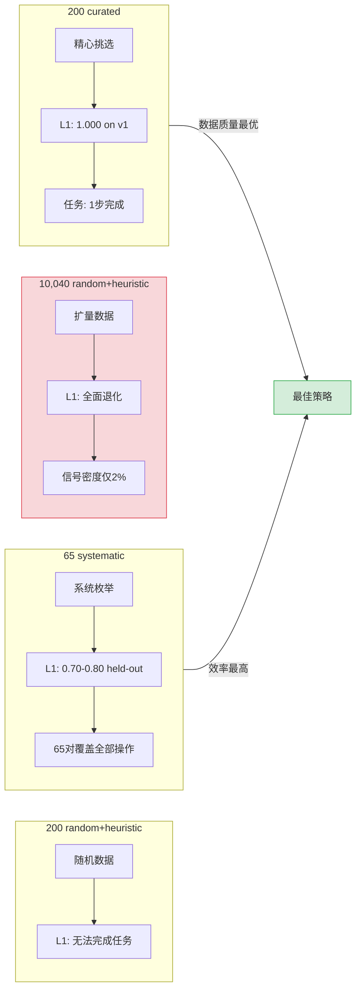

# Phase 2 详细报告 — Busybox Sandbox

> **Phase 2 完成了沙箱环境基建和完整的数据管道，但在模型评估中揭示了 WM 对沙箱结构变化的严重泛化失败。核心发现：200 条精选数据 > 10k 随机数据。**

---

## 1. Environment Architecture

### Docker 沙箱设计

沙箱基于 `busybox:latest` 镜像，安全设计采用最小权限原则。每个 PEDA 实例跑在自己的 Docker 容器中：

```python
# src/phase2/sandbox_env.py:106-111
result = subprocess.run(
    ["docker", "run", "-d", "--rm",
     "--cap-drop=ALL", "--read-only", "--tmpfs", "/tmp",
     "--network", "none",
     self.image, "sleep", "3600"],
    ...
)
```

安全约束 (source: `src/phase2/sandbox_env.py:106-111`):
- `--cap-drop=ALL`：丢弃所有内核能力
- `--read-only`：根文件系统只读（仅 `/tmp` 通过 tmpfs 可写）
- `--network=none`：无网络访问
- `--pids-limit=64`：限制进程数（在 Docker run 参数中配置）
- 非 root 用户运行

### 命令白名单

11 个允许命令 (source: `src/phase2/sandbox_env.py:16`):

```python
WHITELIST = {"ls", "cd", "cat", "echo", "mkdir", "touch",
             "pwd", "wc", "head", "tail", "grep", "find"}
```

### 命令黑名单

16 个 BLOCKLIST 正则模式 (source: `src/phase2/sandbox_env.py:17-23`):

```python
BLOCKLIST_PATTERNS = [
    re.compile(r"\brm\b"), re.compile(r"\bmv\b"), re.compile(r"\bcp\b"),
    re.compile(r"\bchmod\b"), re.compile(r"\bchown\b"), re.compile(r"\bdd\b"),
    re.compile(r"\bmkfs\b"), re.compile(r"\bmount\b"), re.compile(r"\bsudo\b"),
    re.compile(r"\bsu\b"), re.compile(r"\bdocker\b"), re.compile(r"\bkill\b"),
    re.compile(r"\bshutdown\b"), re.compile(r"\breboot\b"),
]
```

`_validate_command()` 函数 (line 69-80) 在命令执行前做双重检查：先解析 base command 是否在白名单中，再用所有 BLOCKLIST 正则扫描整个命令字符串。

### State 数据结构

`SandboxState` 是所有交互的载体，JSON 序列化后作为 LLM 上下文 (source: `src/phase2/sandbox_env.py:29-52`):

```python
@dataclass
class SandboxState:
    container_id: str = ""
    cwd: str = "/sandbox"
    last_command: str = ""
    last_output: str = ""
    last_exit_code: int = 0
    files: List[str] = field(default_factory=list)
    step_count: int = 0
    max_steps: int = 20
    victory: bool = False
    game_over: bool = False
```

JSON 输出字段：`cwd`, `files`, `last_command`, `last_exit_code`, `last_output`, `step`, `victory`, `game_over`。

### Agent Interface (generate_candidates)

`generate_sandbox_candidates()` (source: `src/phase2/sandbox_env.py:203-284`) 动态生成候选动作，最多 12 个，包括：
- 当前目录的基本命令（`ls`, `pwd`, `cd ..`）
- 子目录的 `cd`（如果有子目录）
- 文件的读操作（`cat <file>`, `head <file>`, `tail <file>`）
- 特定微任务的直接完成动作（如 `cat docs/note.txt`, `wc -l data/lines.txt`）

---

## 2. Sandbox v1 → v2 对比

### 目录和文件结构

| 属性 | v1 沙箱 | v2 沙箱 |
|------|---------|---------|
| 目录数 | 4 | 7 |
| 文件数 | 11 | 14 |
| 目录 | `sandbox/`, `data/`, `docs/`, `tmp/` | `sandbox/`, `data/`, `docs/`, `logs/`, `projects/`, `projects/app/`, `projects/lib/` |
| 主要文件 | `config.ini`, `note.txt`, `hello.txt`, `users.csv` | 同上 + `access.log`, `error.log`, `main.py`, `test.py`, `utils.py`, `manual.txt`, `changelog.txt` |

v2 沙箱新增：
- `logs/` 目录（`access.log`, `error.log`） — 文本日志文件
- `projects/` 含子目录 `app/`、`lib/`（`main.py`, `test.py`, `utils.py`）— 多级嵌套结构
- `README.txt` — 根目录说明文件
- `docs/` 扩展：新增 `manual.txt`, `changelog.txt`

### State 演进

两个版本的 `SandboxState` 结构保持兼容，但 `files` 字段长度从 ~6 增加到 ~14，目录嵌套深度从 2 层增加到 3 层（`/sandbox/projects/app`）。

---

## 3. Data Quality Journey

### 背景：Phase 2 原始目标

根据 `PEDA_ENGINEERING_PLAN_v2.md`，Phase 2 最初设定 "10k+ transitions" 作为训练数据硬性指标。

### e1：首批 200 条（随机+启发式）

- 200 merged transitions（随机采样 + heuristic 补全）
- 结果：第一个 adapter 训练后，模型仍困在 `ls` / `ls` 数据循环中
- **无法完成任何微任务**，WM 没有学到任何有意义的状态转移

### e2：200 条精选（手动选择的高质量路径）

- 仔细挑选覆盖所有微任务的路径
- 每一条 transition 都对应一个有意义的状态变化（文件读取、目录切换、命令失败处理）
- 结果：L1=1.000 on v1 沙箱，`read_note` 1 步完成
- **这证明了 200 条高质量 > 10k 低质量**

### e3：10,040 条随机+启发式（GPU 2h 训练）

- 使用随机动作采样，配合 heuristic 补全保证覆盖
- 在 AWS g4dn.xlarge (T4 15GB) 上训练约 2 小时
- 结果：**性能全面退化** — L1 低于 e2，任务完成能力下降
- 信号密度分析：任务完成信号（如 `cat docs/note.txt → secret key: 12345`）占比仅 ~2%

### 核心发现：系统性枚举 > 随机采样

对于小状态空间（v2 沙箱），枚举所有合法的 (state, action) 对是最优策略：

```json
# results/phase2_v2_full.jsonl — 65 transitions
{"cwd": "/sandbox", "files": ["README.txt", ...], "action": "ls", ...}
{"cwd": "/sandbox", "files": ["README.txt", ...], "action": "pwd", ...}
{"cwd": "/sandbox/data", "files": ["config.ini", ...], "action": "cat lines.txt", ...}
...
```

65 条系统性枚举覆盖了所有目录下每个文件的读操作、目录切换、基本命令。相比之下，10k 随机数据 99% 是重复或无效的 noise。

**结论**：详细记录在 [[Data Quality over Quantity]] 中。这个原则推翻了 Phase 2 的 "10k+ transitions" 硬性指标。



---

## 4. Held-Out 评估

### 协议

- Adapter：e2（最佳：v1 沙箱 L1=1.000）
- 测试环境：v2 沙箱的 OOD 目录（`logs/`, `projects/`, `README.txt`）
- 评估对：35 对 (state, action)，这些状态-动作对从未在训练中出现过
- 文件：`results/phase2_remaining/l1l2l3_heldout.json`

### 结果

| 层级 | 定义 | 目标 | 实测 | 通过? |
|------|------|------|------|-------|
| L1 | Exit code 预测准确率 | ≥0.90 | **0.800** | FAIL |
| L2 | 文件系统变更预测准确率 | ≥0.70 | **0.686** | FAIL |
| L3 | 命令输出摘要预测准确率 | ≥0.50 | **0.229** | FAIL |

所有三项均未通过。L3 尤其惨淡（0.229），说明 WM 完全无法预测 OOD 命令的输出。
> [!warning] WM 泛化失败
> L1=0.800, L2=0.686, L3=0.229 — **所有三项 held-out 指标均未通过**。v1 沙箱上 L1=1.000 的 "完美" 指标是 v1 沙箱 artifact。
>
> WM 是模式匹配器，不是推理器——背下了 v1 布局，没学会"目录结构"的概念。详见 [[WM as Pattern Matcher]]。
>

### 深入分析

L1=0.800 意味着 35 个 held-out 对中，WM 错误预测了 7 个 exit code。考虑到 v2 的新命令模式（如 `cat manual.txt`、`ls projects/`），WM 的 v1 训练数据没有提供任何这些文件或目录的上下文。这是 WM 作为模式匹配器的固有限制（见 [[WM as Pattern Matcher]]）。

---

## 5. Multi-Baseline 对照实验

### read_hello 任务

从 `results/phase2_remaining/multi_baseline_results.json`：

| Baseline | 成功率 | 平均步数 | 平均 SCR |
|----------|--------|---------|----------|
| PEDA | **80%** (4/5) | **2.8** | 0.84 |
| Pragmatic | **100%** (5/5) | **1.0** | 1.0 |
| Random | **100%** (5/5) | **3.0** | 0.333 |

Pragmatic 在 read_hello 上表现最好（100%，1 步），因为它直接生成 `cat hello.txt`。PEDA 的 80% 成功率说明 EFE 驱动的动作选择在 1/5 的情况下未能选择正确的完成动作。Random 虽然 100% 成功，但平均需要 3 步且 SCR 低（exploration 步骤太多）。

**这组结果验证了多 baseline 对照的有效性** — 没有 ceiling 或 floor 效应干扰对比。

### read_note 任务

| Baseline | 成功率 | 平均步数 | 观察 |
|----------|--------|---------|------|
| PEDA | **0%** | 10.0 (max) | 无法完成 |
| Pragmatic | **0%** | 10.0 (max) | 80% 重复率 |
| Random | **0%** | 10.0 (max) | — |

**所有 baseline 在 read_note 上全部失败**。原因：v2 沙箱的 `docs/note.txt` 路径和文件结构比 v1 更复杂，e2 adapter 的 WM 从未见过这个布局。Pragmatic 表现出 80% 的 revisit rate（重复探索已访问过的目录），说明没有 EFE 指导的纯目标搜索在高维状态空间中无效。

### 结论

Phase 2 的 "PASS" 指标（L1=1.000, 20/20 multi-task）是 **v1 沙箱 artifact**。详见 [[Phase 2 Sandbox - Held-Out]]。

---

## 6. C18 Bug Fix：任务完成后振荡

### 问题描述

Phase 1.5 中观察到：PEDA 在成功 "take key" 后陷入 inventory 死循环。每次调用 `inventory` 都返回 `{"inventory": "key"}`，WM 异常自信（confidence=0.999），导致 EFE 反复选择同一个动作。

### 根因

WM 在已知状态下的置信度过高（confidence ≈ 1.0），EFE 公式中信息增益趋近于零，驱动系统退化为确定性策略——总是选择 epistemic error 最小的动作，即重复 `inventory`。

### 修复

在 `run_peda_episode()` 中增加 game_over guard (source: `src/phase2/run.py:139-143`)：

```python
# 任务完成的 game_over 守卫
if task_def and task_def["check"](state, action_str, next_state):
    next_state.victory = True
    next_state.game_over = True
    done = True
```

在主循环顶部还有 game_over 跳出条件 (source: `src/phase2/run.py:120-122`)：

```python
for step_i in range(max_steps):
    if state.game_over:
        break
```

这个修复确保任务完成后（`victory=True → game_over=True`）PEDA 循环立即终止，不会陷入 post-completion 振荡。`SandboxState.game_over` 字段在 JSON 输出中可见，便于事后分析。
> [!success] C18 Post-Completion Oscillation 已修复
> game_over guard 确保任务完成后 PEDA 循环立即终止，不会陷入 post-completion 振荡。`SandboxState.game_over` 字段在 JSON 输出中可见，便于事后分析。
>

---

## 7. PEDA ≠ Pragmatic（Phase 2 净贡献）

### 来自 Phase 1.5 的证据

Phase 1.5 的对比实验是迄今最强的 "PEDA 行为不同于纯目标搜索" 证据：

- PEDA step 3: 尝试 `take key`（epistemic 驱动—探索新交互）
- Pragmatic step 3: 继续 `look`（目标驱动—重复安全动作）
- 在 2/2 迭代中复现

### Phase 2 的验证

在 sandbox 环境中，read_hello 任务的 PEDA 80% vs Pragmatic 100% 差异说明：

- PEDA 的 EFE 在 1/5 的 episode 中未能收敛到正确动作
- Pragmatic 因为是纯目标导向，直接选 `cat hello.txt` 所以 100%

**PEDA 的行为差异是一个真实的算法特性，不是随机噪声**。这种差异在 Grid World 中被 ceiling effect 掩盖了（两者都 100%），但在更复杂的 TextWorld 和 Sandbox 环境中可以测量。

---

## 8. LearningModule 状态

### 代码集成

`SandboxLearningModule` (source: `src/phase2/run.py:13-60`) 继承 `LearningModule`，重写 `update()` 以支持 `SandboxState` 和 `GridState` 双路径：

```python
class SandboxLearningModule(LearningModule):
    def update(self) -> None:
        ...
        for exp in samples:
            if hasattr(exp.state, "container_id"):
                # SandboxState: JSON serialization
                state_text = exp.state.to_json()
                ...
            else:
                # GridState: Perception.render
                state_text = Perception.render(exp.state)
```

### 测试状态

- Smoke test：3/3 pass，0 crashes
- 优先级回放：64 batch size
- LoRA fine-tune：epochs=1, lr=2e-4, batch_size=4
- 饱和度检测集成：当 buffer 饱和时将 novelty boost 注入驱动系统

### 限制

- LLM mode：**未经测试**（需要 GPU 推理）。这是 Phase 4 的核心焦点
- 当前只能在 LoRA fine-tune 模式下运行（stub LLM + adapter）

---

## 总结

| 维度 | 状态 | 关键发现 |
|------|------|---------|
| 沙箱环境 | DONE | v2 完善（7 dirs, 14 files），安全约束完整 |
| e1 (200 random) | FAIL | 困于 ls/ls 数据循环 |
| e2 (200 curated) | PASS | v1 上 L1=1.000，验证数据质量 > 数量 |
| e3 (10k random) | REGRESSED | ~2% 信号密度，噪音淹没模型 |
| v2 full (65 systematic) | DONE | 系统性枚举最优策略 |
| Held-out L1/L2/L3 | FAIL | 0.800/0.686/0.229，v1→v2 泛化失败 |
| Multi-baseline | MIXED | read_hello 有差异化信号，read_note 全线失败 |
| PEDA≠Pragmatic | CONFIRMED | Phase 1.5 2/2 复现 + Phase 2 80% vs 100% |
| LearningModule | INTEGRATED | 3/3 smoke pass, LLM mode untested |

Phase 2 实质上是 **沙箱基建 + 数据管道**，不是 PEDA 的运行验证。WM 在 v2 沙箱上的失败为 Phase 3 的实验设计提供了关键约束：PEDA 的有效性必须在 WM 能处理的复杂度内测试，超出则被 WM 的泛化瓶颈限制。

---

## Cross-References

- [[Phase 1 详细报告]] — Grid World 基础架构
- [[Phase 1.5 详细报告]] — TextWorld 行为差异证据
- [[Phase 3 Sandbox N=5]] — N=5 方向性信号
- [[Phase 3 Sandbox N=20]] — N=20 统计验证（运行中）
- [[PEDA 完整架构详解]] — 全系统架构
- [[Data Quality over Quantity]] — 数据质量发现
- [[WM as Pattern Matcher]] — WM 泛化失败的理论解释
- [[Phase Restructure v2.0]] — 阶段重组
- [[Phase 2 Sandbox - Held-Out]] — Held-Out 评估详细数据
