# 密码算法群结构分类分析
# Group Structure Classification Analysis of Cryptographic Algorithms

> 本文档系统整理常见加密算法的群结构分类，包含数学定义、复杂度分析和可视化对比。
> This document systematically categorizes common cryptographic algorithms by their group structure, including mathematical definitions, complexity analysis, and visual comparisons.

---

## 一、概述 / Overview

现代密码学中，大量核心算法的安全性依赖于特定代数结构上的困难问题。**群论**提供了统一的语言来定义这些结构、表述安全假设并分析攻击复杂度。本报告将常见算法按 **群结构性质** 分为三类：

- **已证明为群 (Proven Groups)**：算法的核心运算定义在一个明确的群上，如 RSA 的 $(\mathbb{Z}/n\mathbb{Z})^\times$、ECC 的 $E(\mathbb{F}_q)$、AES 的 $\mathrm{GF}(2^8)$。
- **已证明非群 (Proven Non-Groups)**：经过严格证明不构成群的结构，如 DES 的置换集合。
- **非群结构 (Non-Group Structures)**：不直接基于群构造的工具，如哈希函数。

In modern cryptography, the security of many core algorithms depends on hard problems in specific algebraic structures. **Group theory** provides a unified language to define these structures, formulate security assumptions, and analyze attack complexity. This report classifies common algorithms by their **group structure properties** into three categories.

---

## 二、群结构分类 / Group Structure Classification

### 2.1 分类层次树 / Classification Hierarchy

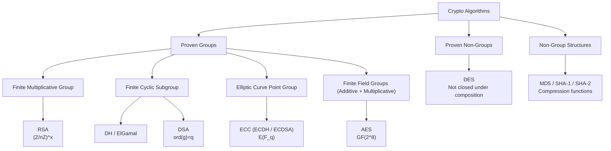

### 2.2 分类汇总表 / Classification Summary Table

| 分类 / Classification | 群结构 / Group Structure | 算法 / Algorithms | 代数类型 / Algebraic Type |
|---|---|---|---|
| **已证明为群 / Proven Group** | $(\mathbb{Z}/n\mathbb{Z})^\times$ | RSA | 有限交换乘法群 / Finite Abelian Multiplicative Group |
| **已证明为群 / Proven Group** | $\langle g \rangle \subseteq (\mathbb{Z}/p\mathbb{Z})^\times$ | DH, ElGamal | 有限循环子群 / Finite Cyclic Subgroup |
| **已证明为群 / Proven Group** | $\langle g \rangle \subseteq (\mathbb{Z}/p\mathbb{Z})^\times$, $\mathrm{ord}(g)=q$ | DSA | 素数阶循环子群 / Prime-order Cyclic Subgroup |
| **已证明为群 / Proven Group** | $E(\mathbb{F}_q)$ | ECDH, ECDSA | 有限Abel群 / Finite Abelian Group (EC Point Group) |
| **已证明为群 / Proven Group** | $(\mathrm{GF}(2^8), +)$, $(\mathrm{GF}(2^8)^\times, \cdot)$ | AES | 加法: 初等Abel 2-群; 乘法: 循环群 / Additive: Elementary Abelian 2-group; Multiplicative: Cyclic |
| **已证明非群 / Proven Non-Group** | $\{E_K : K \in \{0,1\}^{56}\}$ | DES | 置换集合, 复合下不封闭 / Permutation set, not closed under composition |
| **非群结构 / Non-Group** | N/A (压缩函数) | MD5, SHA-1, SHA-2 | Merkle-Damgard 迭代结构 / Merkle-Damgard Iterated Construction |

---

## 三、已证明为群的算法详解 / Proven Group Algorithms

### 3.1 RSA

**群结构 / Group Structure**

$$(\mathbb{Z}/n\mathbb{Z})^\times, \quad n = pq,\; p,q \text{ 为大素数 / large primes}$$

群阶 / Group order: $|(\mathbb{Z}/n\mathbb{Z})^\times| = \varphi(n) = (p-1)(q-1)$

RSA 加密/解密本质上是该群中的幂运算：
$$c = m^e \pmod{n}, \quad m = c^d \pmod{n},\quad ed \equiv 1 \pmod{\varphi(n)}$$

| 条目 / Item | 内容 / Content |
|---|---|
| **细分群类 / Subgroup Classification** | 有限交换乘法群 / Finite Abelian Multiplicative Group（$n$ 为合数时**不是**循环群 / Not cyclic when $n$ is composite） |
| **算法 / Algorithm** | RSA-OAEP (加密), RSA-PSS (签名), PKCS#1 v1.5 |
| **时间复杂度 / Time Complexity** | $O((\log n)^3)$ — 模幂运算 (平方乘算法) / Modular exponentiation (square-and-multiply) |
| **安全复杂度 (攻击) / Security Complexity** | **亚指数级 / Sub-exponential** (GNFS 数域筛法): $O\left(\exp\left(\left(\frac{64}{9}\right)^{1/3} (\log n)^{1/3} (\log \log n)^{2/3}\right)\right)$ |
| **安全假设 / Security Assumption** | 大整数分解难题 (RSA 假设) / Integer Factorization (RSA Assumption) |
| **NIST 等效安全 / NIST Security** | RSA-3072 $\sim$ AES-128, RSA-15360 $\sim$ AES-256 |

**备注 / Notes**
- 群阶 $\varphi(n)$ 未知是 RSA 安全性的直觉来源——若攻击者能计算 $\varphi(n)$，即可直接求出私钥 $d$。
- RSA-1024 及以下已被认为不安全（NIST SP 800-131A）。

---

### 3.2 Diffie-Hellman 与 ElGamal / Diffie-Hellman & ElGamal

**群结构 / Group Structure**

$$\langle g \rangle \subseteq (\mathbb{Z}/p\mathbb{Z})^\times, \quad p \text{ 为大素数}, \; \mathrm{ord}(g) = q \mid p-1,\; q \text{ 为大素数}$$

DH 密钥交换：
$$g^a, g^b \longrightarrow g^{ab}$$

ElGamal 加密（公钥 $h = g^x$，密文 $(c_1, c_2) = (g^y, m \cdot h^y)$）：
$$c_1 = g^y,\quad c_2 = m \cdot h^y,\quad m = c_2 \cdot c_1^{-x}$$

| 条目 / Item | 内容 / Content |
|---|---|
| **细分群类 / Subgroup Classification** | **有限循环子群** — 素数阶子群 $\langle g \rangle$ / Finite Cyclic Subgroup of prime order |
| **算法 / Algorithm** | DH (密钥交换), ElGamal (公钥加密), DLP-based 变体 |
| **时间复杂度 / Time Complexity** | $O((\log p)^3)$ — 模幂运算 / Modular exponentiation |
| **安全复杂度 / Security Complexity** | **亚指数级 / Sub-exponential** (GNFS 攻击 $\mathbb{Z}/p\mathbb{Z}$ 上的 DLP): $L_p[1/3, c]$ |
| **安全假设 / Security Assumption** | 离散对数假设 (DLP), 计算性 Diffie-Hellman 假设 (CDH), 判定性 DH 假设 (DDH) |
| **NIST 等效安全 / NIST Security** | DH-3072 $\sim$ AES-128, DH-15360 $\sim$ AES-256 |

**备注 / Notes**
- 实践中使用 **素数阶子群** 防止 Pohlig-Hellman 攻击；$q$ 通常为 256-bit 安全素数。
- ElGamal 密文扩展因子为 2（密文是明文大小的两倍）。

---

### 3.3 DSA (Digital Signature Algorithm)

**群结构 / Group Structure**

$$\langle g \rangle \subseteq (\mathbb{Z}/p\mathbb{Z})^\times, \quad \mathrm{ord}(g) = q,\; p,q \text{ 素数},\; q \mid p-1$$

签名 $(r, s)$：
$$r = (g^k \bmod p) \bmod q, \quad s = k^{-1}(H(m) + xr) \bmod q$$

| 条目 / Item | 内容 / Content |
|---|---|
| **细分群类 / Subgroup Classification** | **素数阶循环子群** — 与 DH/ElGamal 相同的群结构 / Prime-order Cyclic Subgroup (same structure as DH/ElGamal) |
| **算法 / Algorithm** | DSA (FIPS 186-4/5), ECDSA (椭圆曲线变体) |
| **时间复杂度 / Time Complexity** | 签名: $O((\log p)^3)$，验证: $O((\log p)^3)$ |
| **安全复杂度 / Security Complexity** | **亚指数级 / Sub-exponential** (同 DH，作用于 $(\mathbb{Z}/p\mathbb{Z})^\times$) |
| **安全假设 / Security Assumption** | 离散对数假设 (DLP) |
| **NIST 等效安全 / NIST Security** | DSA-3072 $\sim$ AES-128, DSA-15360 $\sim$ AES-256 |

**备注 / Notes**
- DSA 的群结构与 DH/ElGamal 本质相同，差异在协议层面（如何将哈希与群运算结合生成签名）。
- ECDSA 将群替换为 $E(\mathbb{F}_q)$，获得更短的密钥和签名。

---

### 3.4 ECC (Elliptic Curve Cryptography)

**群结构 / Group Structure**

$$E(\mathbb{F}_q) = \{(x, y) \in \mathbb{F}_q^2 : y^2 = x^3 + ax + b\} \cup \{\mathcal{O}\}$$

其中 $4a^3 + 27b^2 \neq 0$，$\mathcal{O}$ 为无穷远点（群单位元）。

**点加法群律 / Point Addition Group Law**

设 $P = (x_1, y_1), Q = (x_2, y_2)$：

$$P + Q = (x_3, y_3)$$

**一般加法 / General addition** ($P \neq \pm Q$)：
$$\lambda = \frac{y_2 - y_1}{x_2 - x_1},\quad x_3 = \lambda^2 - x_1 - x_2,\quad y_3 = \lambda(x_1 - x_3) - y_1$$

**倍点 / Point doubling** ($P = Q, y_1 \neq 0$)：
$$\lambda = \frac{3x_1^2 + a}{2y_1},\quad x_3 = \lambda^2 - 2x_1,\quad y_3 = \lambda(x_1 - x_3) - y_1$$

Hasse 定理给出群的近似阶：$|E(\mathbb{F}_q)| \approx q + 1 \pm 2\sqrt{q}$

| 条目 / Item | 内容 / Content |
|---|---|
| **细分群类 / Subgroup Classification** | **有限Abel群（椭圆曲线点群）** / Finite Abelian Group (Elliptic Curve Point Group) |
| **算法 / Algorithm** | ECDH (密钥交换), ECDSA (签名), ECIES (加密), EdDSA (Ed25519) |
| **时间复杂度 / Time Complexity** | 标量乘 $kP$: $O((\log q)^3)$，使用双基链加速可降至 $\approx O((\log q)^2)$ |
| **安全复杂度 / Security Complexity** | **指数级 / Exponential** (对一般椭圆曲线): $O(2^{n/2})$ — Pollard $\rho$ 算法; 对超奇异曲线可降至亚指数（需谨慎选取曲线） |
| **安全假设 / Security Assumption** | 椭圆曲线离散对数假设 (ECDLP) |
| **NIST 等效安全 / NIST Security** | ECC-256 $\sim$ AES-128, ECC-384 $\sim$ AES-192, ECC-521 $\sim$ AES-256 |

**备注 / Notes**
- ECC 在相同安全强度下密钥长度远小于 RSA/DH（如 256-bit $\sim$ 3072-bit），这是 ECC 最核心的优势。
- 实际安全性取决于曲线选择：建议使用 NIST P-系列、Curve25519 或 secp256k1 等标准化曲线。
- 后量子场景下 ECDLP 可被 Shor 算法在 $O((\log q)^3)$ 量子门内破解，但 ECC 仍在经典密码学中广泛使用。

---

### 3.5 AES (Advanced Encryption Standard)

**群结构 / Group Structure**

AES 的操作定义在有限域 $\mathrm{GF}(2^8)$ 上：

$$\mathrm{GF}(2^8) \cong \mathbb{F}_2[x]/(x^8 + x^4 + x^3 + x + 1)$$

涉及两种群结构：
- **加法群** $(\mathrm{GF}(2^8), +)$：逐位 XOR，本质为 8 维 $\mathbb{F}_2$-向量空间的加法群（初等 Abel 2-群）。
- **乘法群** $(\mathrm{GF}(2^8)^\times, \cdot)$：255 阶循环群，用于 MixColumns。

整个状态可视为 $(\mathrm{GF}(2^8))^{4 \times 4}$ 上的仿射-线性变换组合。

| 条目 / Item | 内容 / Content |
|---|---|
| **细分群类 / Subgroup Classification** | **加法**：初等 Abel 2-群 (Elementary Abelian 2-group); **乘法**：循环群 (Cyclic group of order 255) |
| **算法 / Algorithm** | AES-128, AES-192, AES-256 (Rijndael) |
| **时间复杂度 / Time Complexity** | $O(1)$ 每块 / per block (字节替代、行移位、列混淆、密钥加四轮操作) |
| **安全复杂度 / Security Complexity** | **指数级 / Exponential** (穷举): AES-128 $O(2^{128})$, AES-192 $O(2^{192})$, AES-256 $O(2^{256})$; 最佳已知攻击 (Biclique) 仅将复杂度降至 $\approx 2^{126.1}$ |
| **安全假设 / Security Assumption** | 无已知数学简化假设; 安全性来自 SPN 结构和充分轮数 |
| **NIST 等效安全 / NIST Security** | AES-128 $\sim$ 128-bit, AES-192 $\sim$ 192-bit, AES-256 $\sim$ 256-bit |

**备注 / Notes**
- AES 的 "群结构" 出现在**字节/字层面**的有限域运算中，而非整个密码算法构成群。
- 在 $(\mathrm{GF}(2^8)^\times, \cdot)$ 上的 MixColumns 操作使用了域乘法；AddRoundKey 使用了加法群运算。
- 所有 AES 密钥对应的置换集合在复合下是否构成群仍在研究中，但已知至少生成本原群。

---

## 四、已证明非群的算法 / Proven Non-Group Algorithms

### 4.1 DES (Data Encryption Standard)

**群结构 / Group Structure**

将每个 DES 密钥 $K \in \{0,1\}^{56}$ 对应的加密函数视为 $\{0,1\}^{64}$ 上的置换 $E_K$。记全体为：

$$\mathcal{D} = \{E_K : K \in \{0,1\}^{56}\}$$

**核心结论：DES 的置换集合在复合下不封闭，即 DES 不是一个群。**

| 条目 / Item | 内容 / Content |
|---|---|
| **细分群类 / Subgroup Classification** | **置换集合，但已证明不构成群 (Proven Non-Group)** — 复合下不封闭 / Permutation set, proven not closed under composition |
| **算法 / Algorithm** | DES, 3DES (TDEA) |
| **时间复杂度 / Time Complexity** | $O(1)$ 每块 / per block (Feistel 结构, 16 轮) |
| **安全复杂度 / Security Complexity** | **穷举 $O(2^{56})$** (已在实际中被 FPGA/ASIC 集群破解); 3DES: $\approx O(2^{112})$ |
| **证明方法 / Proof Method** | Campbell & Wiener (CRYPTO '92): 计算随机复合的周期，证明 $\mathcal{D}$ 在复合下扩张，生成的子群规模 $\gg 2^{56}$ |

**历史里程碑 / Historical Milestones**
- **1988**: Kaliski, Rivest, Sherman 通过统计循环实验给出 "DES 不是群" 的强烈证据。
- **1992**: Campbell & Wiener 严格证明 DES 不成群，估计所生成的子群规模 $\geq 10^{2499}$。
- **实践意义**: 多重 DES (如 3DES) 不等价于单次 DES，安全性确实随轮数增加。

**备注 / Notes**
- DES 不成群的证明排除了 "三重 DES 等价于某单密钥 DES" 的威胁。
- 后续工作（Blackburn, Cid, Mullan; Aragona 等）研究了 AES 和轻量密码的轮函数生成交错群 $A_{2^{128}}$，属于 "群论用于对称密码设计" 的典型方向。

---

## 五、非群结构密码工具 / Non-Group Cryptographic Tools

### 5.1 哈希函数 / Hash Functions (MD5, SHA-1, SHA-2)

**结构说明 / Structure Description**

哈希函数不直接建立在群上的困难问题，而是通过迭代压缩函数构造：
- **Merkle-Damgard 构造**: MD5, SHA-1, SHA-2
- **Sponge 构造**: SHA-3 (不在本报告讨论范围内)

| 条目 / Item | 内容 / Content |
|---|---|
| **细分群类 / Subgroup Classification** | **非群结构 / Non-Group Structure** — 压缩函数 + 迭代构造 / Compression function + iterated construction |
| **算法 / Algorithm** | MD5, SHA-1, SHA-224/256/384/512 |
| **时间复杂度 / Time Complexity** | $O(1)$ 每块 / per block（线性于输入长度） |
| **安全复杂度 (碰撞) / Security Complexity** | MD5: $\approx O(2^{39})$ (已破解); SHA-1: $\approx O(2^{63})$ (已破解); SHA-256: $\approx O(2^{128})$ (安全) |
| **安全假设 / Security Assumption** | 原像抵抗、第二原像抵抗、碰撞抵抗 / Preimage resistance, 2nd-preimage resistance, collision resistance |

**备注 / Notes**
- 尽管哈希函数不直接是群，但在 hash-then-sign 范式及某些安全性证明中会涉及群的抽象性质。
- 一些基于群/格的哈希函数构造（如 VSH, SWIFFT）属于密码学中群论与哈希的交叉研究方向。

---

## 六、综合对比 / Comprehensive Comparison

### 6.1 密钥长度等效对比 / Equivalent Key Size Comparison

以下按 NIST SP 800-57 的安全强度分类：

| 安全强度 / Security Strength (bits) | RSA 密钥长度 / RSA Key (bits) | DH/DSA 密钥长度 / DH/DSA Key (bits) | ECC 密钥长度 / ECC Key (bits) | AES 密钥长度 / AES Key (bits) |
|---|---:|---:|---:|---:|
| 80 (已废弃 / Legacy) | 1024 | 1024 | 160 | — |
| 112 (已废弃 / Legacy) | 2048 | 2048 | 224 | — |
| **128** (Level I) | **3072** | **3072** | **256** | **128** |
| **192** (Level III) | **7680** | **7680** | **384** | **192** |
| **256** (Level V) | **15360** | **15360** | **521** | **256** |

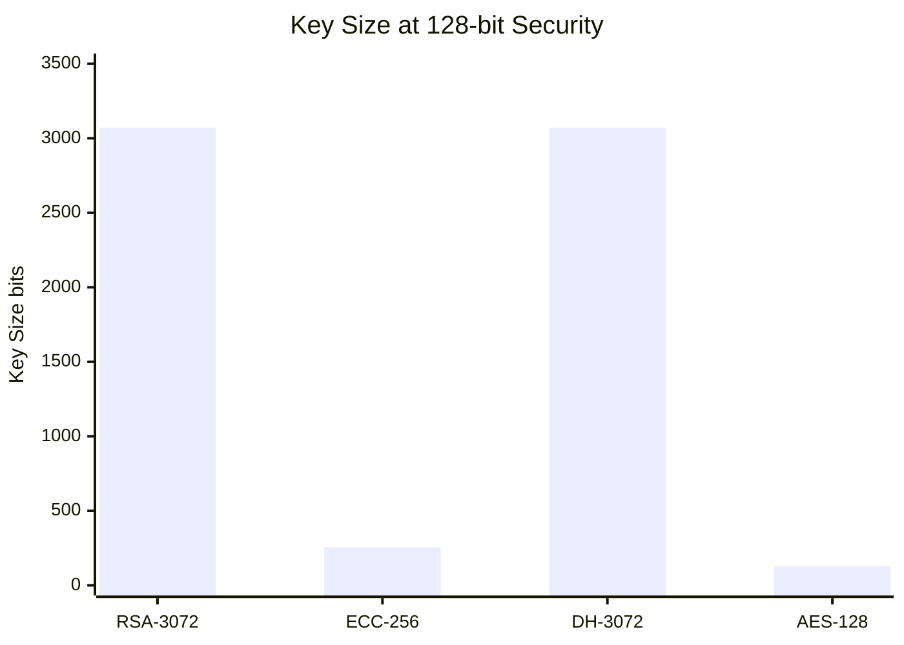

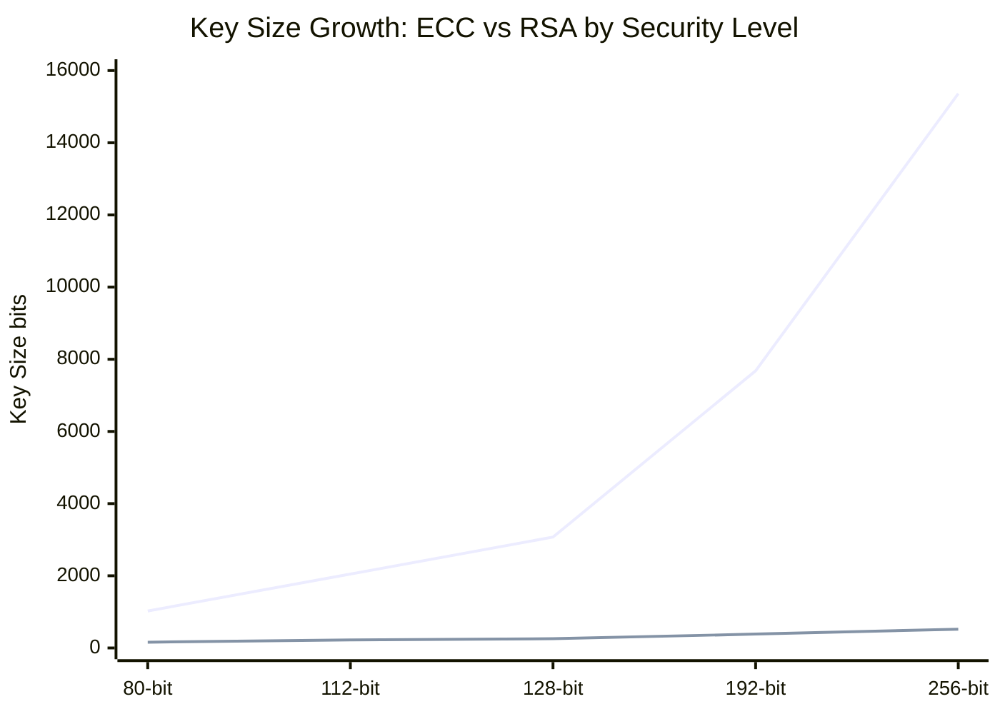

### 6.2 时间复杂度对比 / Time Complexity Comparison

| 算法 / Algorithm | 操作 / Operation | 时间复杂度 / Time Complexity | 相对速度估计 / Relative Speed Estimate |
|---|---|---|---|
| **RSA-3072** | 加密 (Encrypt) | $O((\log n)^3)$ | $\sim 1$ (基准) |
| **RSA-3072** | 解密 (Decrypt) | $O((\log n)^3)$ | $\sim 0.1\times$ (使用 CRT 加速) |
| **DH-3072** | 密钥生成 | $O((\log p)^3)$ | $\sim 1\times$ |
| **ECC-256** | 标量乘 / Scalar mult | $O((\log q)^3)$ | $\sim 5\text{--}10\times$ (较 RSA-3072 加密) |
| **ECC-256** | 签名 / Sign | $O((\log q)^3)$ | $\sim 5\text{--}10\times$ |
| **AES-128** | 加密 / 解密 | $O(1)$ 每块 | $\sim 1000\times$ (较 RSA-3072) |
| **SHA-256** | 哈希 / Hash | $O(1)$ 每块 | $\sim 500\times$ (较 RSA-3072) |
| **DES** | 加密 / 解密 | $O(1)$ 每块 | $\sim 5\times$ slower than AES |

### 6.3 安全强度增长对比 / Security Strength Growth

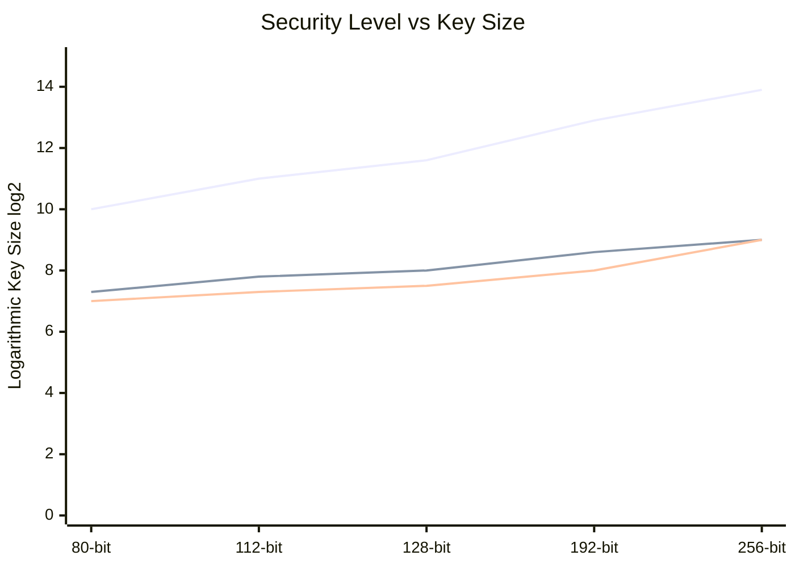

**解读 / Interpretation**: ECC 密钥长度随安全级别线性增长（对数坐标下斜率小），而 RSA/DH 的密钥长度增长快得多。这是 ECC 的核心优势。

### 6.4 优劣综合对比 / Comprehensive Pros and Cons

| 算法 / Algorithm | 优势 / Advantages | 劣势 / Disadvantages | 群结构特点 / Group Feature |
|---|---|---|---|
| **RSA** | 广泛标准化和部署; 概念简单直观 | 密钥尺寸大; 解密慢; 无前向安全性 | 合数阶乘法群, 阶未知 |
| **DH** | 支持前向安全 (DHE); 协议简洁 | 密钥尺寸大; 无认证 (需搭配签名) | 素数阶循环子群 |
| **ElGamal** | 语义安全 (基于 DDH); 概念清晰 | 密文扩展 2x; 速度慢; 无标准化 | 同 DH 群结构 |
| **DSA** | 标准化成熟; 高效签名验证 | 依赖安全随机数; 验证较签名慢 | 素数阶循环子群 (同 DH) |
| **ECC** | **密钥最短**; 运算快; 强安全比 | 参数选择复杂; 侧信道攻击面大 | 椭圆曲线 Abel 群, 指数级安全 |
| **AES** | **极快**; 硬件加速; 无已知实际攻击 | 对称密钥分发问题; 密钥管理负载 | GF(2^8) 加法/乘法群（字节级） |
| **DES** | 历史意义重大; 促成现代密码学 | 56-bit 密钥已破解; 64-bit 分组太小 | 已证明非群, 多重加密安全 |
| **SHA-256** | 快速; 广泛部署; 仍在安全期 | 输出尺寸大 (相对 SHA-3); MAC 构造需 HMAC | 非群结构 (压缩函数) |

### 6.5 标准化与部署状况 / Standards & Deployment

| 算法 / Algorithm | NIST 标准 | TLS 1.3 | 区块链 / Blockchain | 后量子安全 / PQC-Ready |
|---|---|---|---|---|
| **RSA** | SP 800-56B | (已弃用 key exchange) | 否 | 否 (Shor) |
| **DH (DHE)** | SP 800-56A | 支持 | 否 | 否 (Shor) |
| **ECDH/ECDSA** | SP 800-56A, FIPS 186-5 | 默认 | 是 (Bitcoin, Ethereum) | 否 (Shor) |
| **EdDSA (Ed25519)** | FIPS 186-5 | 支持 | 是 | 否 (Shor) |
| **AES** | FIPS 197 | 支持 (AEAD) | 是 | 可能 (Grover 减半安全) |
| **SHA-2** | FIPS 180-4 | 支持 | 是 | 可能 |

### 6.6 性能综合对比 / Performance Comparison

相对吞吐量估计（以 RSA-3072 解密 = 1 为基准）：

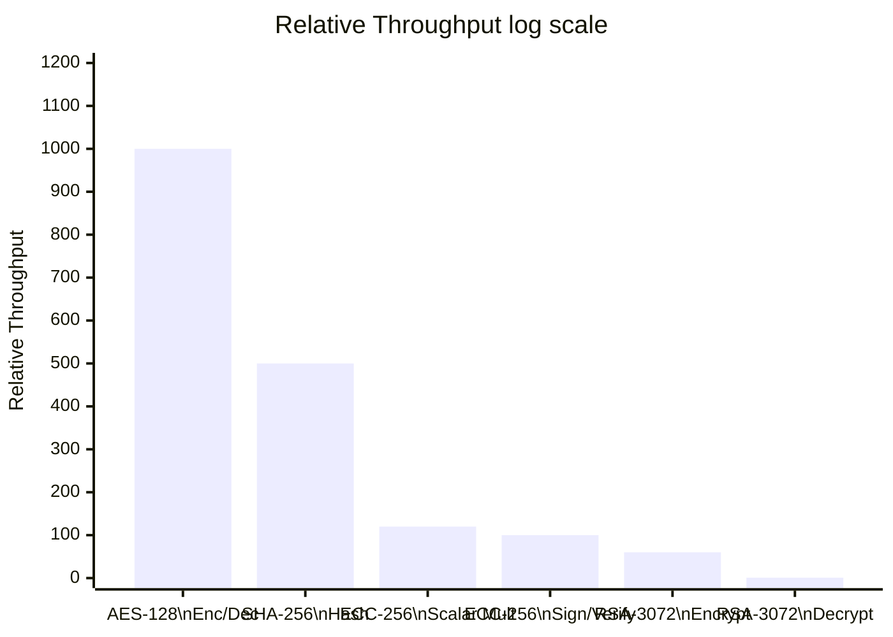

注：实际性能取决于具体实现、硬件加速（AES-NI）和参数选择。AES-NI 指令集可使 AES 比纯软件快 10 倍以上。

Note: Actual performance depends on implementation, hardware acceleration (AES-NI), and parameter choices. AES-NI instructions can make AES 10x+ faster than software-only implementation.

---

### 6.7 DH 密钥交换协议流程 / DH Key Exchange Protocol Flow

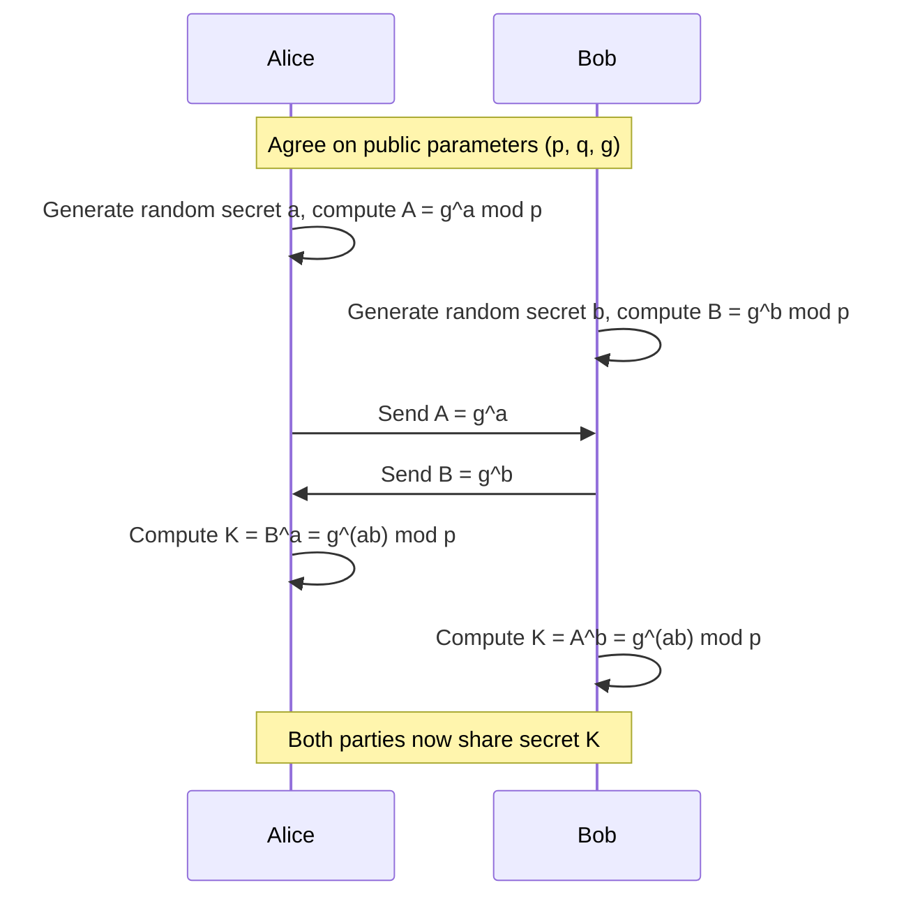

在 $(\mathbb{Z}/p\mathbb{Z})^\times$ 的素数阶子群 $\langle g \rangle$ 上进行运算。ECDH 在此框架下将乘法群替换为 $E(\mathbb{F}_q)$ 上的椭圆曲线点群。

This operates in the prime-order subgroup $\langle g \rangle$ of $(\mathbb{Z}/p\mathbb{Z})^\times$. ECDH replaces this multiplicative group with the elliptic curve point group $E(\mathbb{F}_q)$.

---

### 6.8 算法选型决策流程 / Algorithm Selection Decision Flow

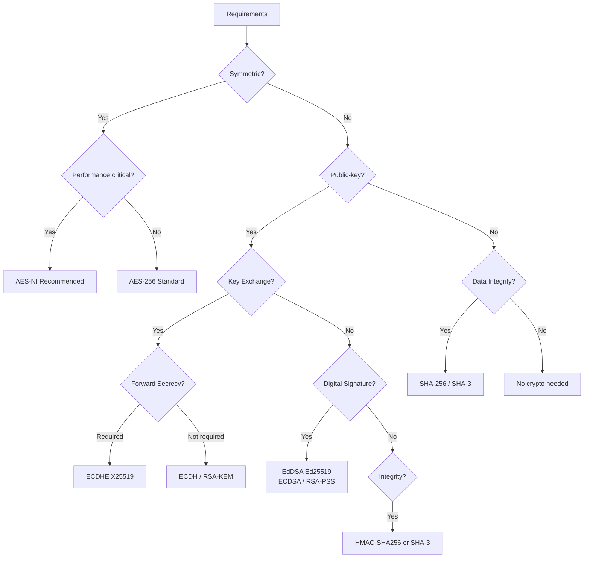

此流程图从应用需求出发，结合各算法的群结构特性给出选型建议。ECC 系列（ECDHE, EdDSA）在大多数场景下是首选，因其密钥短、性能优、安全强度高。

This flowchart guides algorithm selection based on application requirements, leveraging each algorithm's group structure characteristics. ECC-based schemes (ECDHE, EdDSA) are generally preferred for their short keys, good performance, and high security strength.

---
## 七、各算法的可视化表示 / Visual Representations of Each Algorithm

> 本节说明各算法可直观图形化的结构和概念，并用 Mermaid 流程图展示关键流程。
> This section describes structures and concepts of each algorithm that can be intuitively visualized, and uses Mermaid diagrams to illustrate key processes.

---

### 7.1 RSA — 密钥生成与加解密流程 / Key Generation & Encryption/Decryption Flow

RSA 的三阶段流程可以清晰地用流程图表示：

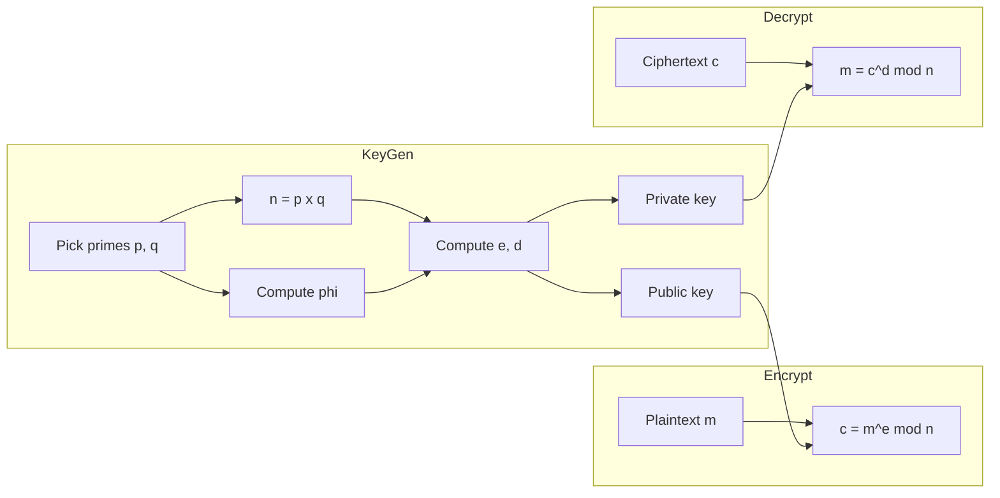

**群结构** = $(\mathbb{Z}/n\mathbb{Z})^\times$，加密/解密 = 群中的 $e$ / $d$ 次幂运算。

---

### 7.2 DH — 密钥交换协议流 / Key Exchange Protocol Flow

DH 的交互协议已在 6.7 节的序列图中展示，其核心群结构为 $(\mathbb{Z}/p\mathbb{Z})^\times$ 的素数阶子群 $\langle g \rangle$。
**色彩混合类比** 是 DH 最直观的教学图形，下方用 Mermaid 序列图展示其协议流程：

The **color-mixing analogy** is the most intuitive pedagogical tool for DH; the Mermaid sequence diagram below shows the actual protocol flow.

色彩类比中，"公开颜料 g" 对应生成元、"私密颜料 a/b" 对应随机数、"混合" 对应指数运算 g^a——而"无法从混合色中分离原色"对应离散对数困难性。

In the color analogy, "public paint g" corresponds to the generator, "secret paints a/b" to random secrets, "mixing" to exponentiation g^a — and the infeasibility of separating the original colors from the mixture corresponds to the hardness of the discrete logarithm.

---

### 7.3 ECC — 椭圆曲线点群几何表示 / Elliptic Curve Point Group Geometry

ECC 是**几何意义最丰富**的密码算法。其核心群 $E(\mathbb{F}_q)$ 定义在 Weierstrass 方程上：

$$E: y^2 = x^3 + ax + b \quad (4a^3 + 27b^2 \neq 0)$$

**点加法的几何直觉 / Geometric Intuition of Point Addition**：

对 $P = (x_1, y_1), Q = (x_2, y_2)$：

1. 连接 $P$ 和 $Q$ 的直线与曲线交于第三点 $R'$
2. 将 $R'$ 关于 $x$ 轴对称反射得 $R = P + Q$
ECC 点加法的几何过程可用下方 Mermaid 流程图表示（**注意**：椭圆曲线本身是对称的曲线图形，需要专用绘图工具渲染；下方是群律的逻辑流程）：

The geometric process of ECC point addition is illustrated in the Mermaid flowchart below (Note: the elliptic curve itself is a symmetric curve graphic requiring a dedicated plotting tool; below is the logical flow of the group law):

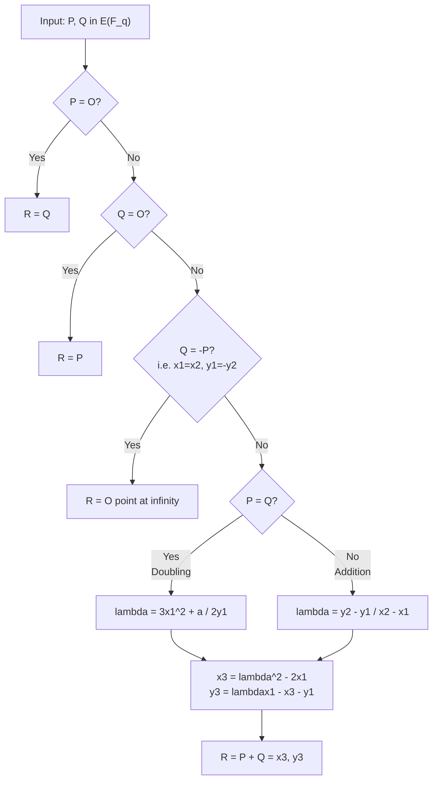

**几何直观解释 / Geometric Explanation**：
- **点加法 (P ≠ Q)**：过 $P$ 和 $Q$ 的直线与曲线交于第三点，反射到 $x$ 轴对面即得 $P+Q$
- **倍点 (P = Q)**：过 $P$ 的切线与曲线交于另一点，反射即得 $2P$
- **逆元**：$P$ 关于 $x$ 轴的对称点即 $-P$，满足 $P + (-P) = \mathcal{O}$

**ECC 的安全性等价于 ECDLP**：给定基点 $G$ 和 $kG$，求 $k$。该群上的已知最优攻击为 Pollard $\rho$ 算法，复杂度 $O(2^{n/2})$，是**指数级**的。

---

### 7.4 AES — 字节层变换的矩阵表示 / Byte-Level Transformation Matrix

AES 的状态可以用 4x4 字节矩阵直观表示，每轮包含四个变换：

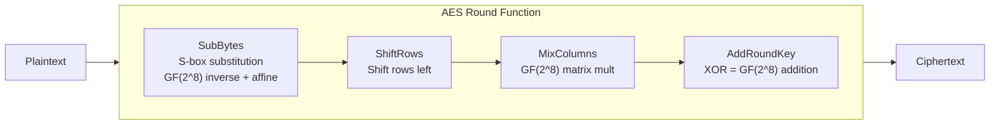

**群结构**：SubBytes 中的字节替换使用 $(\mathrm{GF}(2^8)^\times, \cdot)$ 的乘法逆；AddRoundKey 使用 $(\mathrm{GF}(2^8), +)$ 的逐位 XOR（初等 Abel 2-群）。

最后一轮省略 MixColumns。

---

### 7.5 DES — Feistel 网络结构 / Feistel Network Structure

DES 的核心是 Feistel 网络，左右半块在每轮中交叉处理：

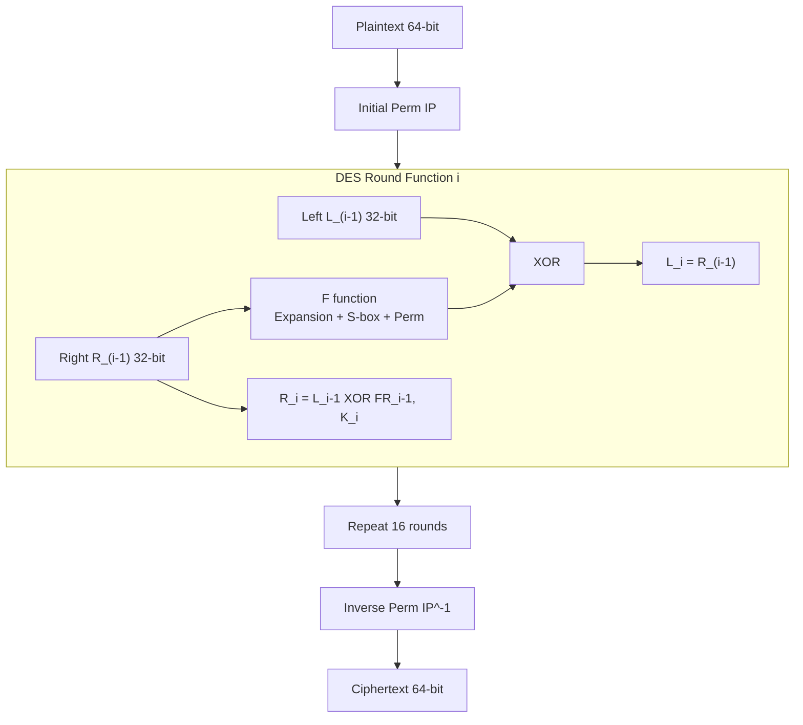

**DES 的置换群性质**：每个密钥 $K$ 确定 $\{0,1\}^{64}$ 上的一个置换 $E_K$。已证明 $\{E_K\}$ 在复合下不封闭，因此 DES 不是群（详见第四章）。

---

### 7.6 哈希函数 — Merkle-Damgard 迭代结构 / Merkle-Damgard Iterated Construction

MD5、SHA-1、SHA-2 均使用 Merkle-Damgard 构造：

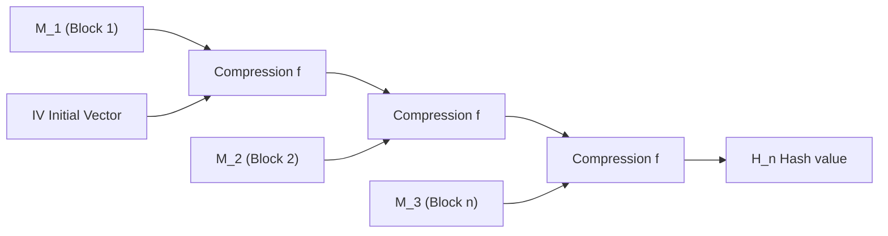

**非群结构**：这类哈希函数不直接基于群上的困难问题，而是依赖压缩函数的抗碰撞性质。

---

### 7.7 可视化汇总表 / Visual Summary Table

| 算法 / Algorithm | 可图形化内容 / Visualizable Content | 推荐图形类型 / Recommended Graphic | 群结构可视化 / Group Visualization |
|---|---|---|---|
| **RSA** | 密钥生成、加密、解密三阶段 | 流程图 / Flowchart | $(\mathbb{Z}/n\mathbb{Z})^\times$ 的幂运算 |
| **DH** | 色彩混合类比、协议交互 | 序列图 / Sequence Diagram + 图示 | 循环子群 $\langle g \rangle$ 的指数运算 |
| **ECC** | **椭圆曲线方程曲线、点加法几何、倍点切线** | 曲线坐标图 / Curve Plot | $E(\mathbb{F}_q)$ 的弦切群律 |
| **AES** | 4x4 状态矩阵变换、轮函数流水线 | 矩阵网格 / Matrix Grid + 流程图 | $\mathrm{GF}(2^8)$ 加法群 XOR + 乘法群运算 |
| **DES** | Feistel 网络、F 函数内部结构 | 网络结构图 / Network Diagram | 置换集合（非群） |
| **SHA-2** | Merkle-Damgard 链接结构 | 链式图 / Chaining Diagram | N/A |

ECC 是唯一具有**几何曲线图形**的算法，这也是它在教学和科普中最常被画出的原因。

---

## 八、群结构数学表达汇总 / Mathematical Summary of Group Structures
## 九、后量子视角 / Post-Quantum Perspective

量子计算对基于群的经典密码构成威胁：

| 算法 / Algorithm | 量子攻击 / Quantum Attack | 破解复杂度 / Complexity |
|---|---|---|
| **RSA** | Shor 算法 | $O((\log n)^3)$ 量子门 |
| **DH / DLP** | Shor 算法 | $O((\log p)^3)$ 量子门 |
| **ECC / ECDLP** | Shor 算法 | $O((\log q)^3)$ 量子门 |
| **AES-128** | Grover 算法 | $O(2^{64})$ 量子门 (安全减半) |
| **AES-256** | Grover 算法 | $O(2^{128})$ 量子门 (仍安全) |
| **SHA-256** | Grover (碰撞) | $O(2^{85})$ 量子门 |

**要点**: 基于交换群的公钥密码（RSA, DH, ECC）可被 Shor 算法多项式时间破解。后量子密码转向格、编码、多变量、哈希签名等非交换/非群结构。

---

## 十、参考文献 / References

### 综述与专著 / Surveys & Monographs

1. Blackburn, S. R., Cid, C., & Mullan, C. (2011). Group theory in cryptography. *Groups St Andrews 2009 in Bath*, LMS Lecture Note Series, Cambridge University Press. [arXiv preprint]
2. Myasnikov, A., Ushakov, A., & Shpilrain, V. (2008). *Group-based Cryptography*. Birkhauser/Springer. [https://link.springer.com/book/10.1007/978-3-7643-8827-0](https://link.springer.com/book/10.1007/978-3-7643-8827-0)
3. Kahrobaei, D., Flores, R., Noce, M., Habeeb, M. E., & Battarbee, C. (2024). *Applications of Group Theory in Cryptography: Post-quantum Group-based Cryptography*. AMS Mathematical Surveys and Monographs 278. [https://bookstore.ams.org/SURV/278](https://bookstore.ams.org/SURV/278)
4. Kahrobaei, D., Flores, R., & Noce, M. (2022). Group-based Cryptography in the Quantum Era. *IACR ePrint 2022/1161*. [https://eprint.iacr.org/2022/1161](https://eprint.iacr.org/2022/1161)

### 教材与手册 / Handbooks & Textbooks

5. Menezes, A. J., van Oorschot, P. C., & Vanstone, S. A. (1996). *Handbook of Applied Cryptography*. CRC Press. [https://cacr.uwaterloo.ca/hac](https://cacr.uwaterloo.ca/hac)
6. Stinson, D. R. *Cryptography: Theory and Practice*. CRC Press. [https://archive.org/details/pdfy-eAEdqcELZKUUU733](https://archive.org/details/pdfy-eAEdqcELZKUUU733)
7. Koblitz, N. (1994). *A Course in Number Theory and Cryptography* (GTM 114, 2nd ed.). Springer. [http://almuhammadi.com/sultan/crypto_books/Koblitz.2ndEd.pdf](http://almuhammadi.com/sultan/crypto_books/Koblitz.2ndEd.pdf)

### ECC 专题 / ECC Specific

8. Hankerson, D., Menezes, A., & Vanstone, S. (2004). *Guide to Elliptic Curve Cryptography*. Springer. [https://link.springer.com/book/10.1007/b97644](https://link.springer.com/book/10.1007/b97644)
9. Blake, I. F., Seroussi, G., & Smart, N. P. (1999). *Elliptic Curves in Cryptography*. CUP. [https://www.cambridge.org/core/books/elliptic-curves-in-cryptography](https://www.cambridge.org/core/books/elliptic-curves-in-cryptography)
10. NASA Technical Report NAS-03-012. *A Survey of Elliptic Curve Cryptosystems, Part I: Introductory*. [https://www.nas.nasa.gov/assets/nas/pdf/techreports/2003/nas-03-012.pdf](https://www.nas.nasa.gov/assets/nas/pdf/techreports/2003/nas-03-012.pdf)

### DES 群结构 / DES Group Structure

11. Kaliski, B. S., Rivest, R. L., & Sherman, A. T. (1988). Is the Data Encryption Standard a group? *J. Cryptology*, 1(1), 3-36. [https://link.springer.com/article/10.1007/BF00206323](https://link.springer.com/article/10.1007/BF00206323)
12. Campbell, K. W. & Wiener, M. J. (1992). DES is not a Group. *CRYPTO '92*, LNCS 740, 512-520. [https://link.springer.com/chapter/10.1007/3-540-48071-4_36](https://link.springer.com/chapter/10.1007/3-540-48071-4_36)

### 对称密码群性质 / Group Properties of Block Ciphers

13. Blackburn, S. R., Cid, C., & Mullan, C. (2011). Group theory in cryptography (Section on primitivity of AES-type ciphers). (同 [1])
14. Aragona, R., Calderini, M., Tortora, A., & Tota, M. (2018). Primitivity of PRESENT and other lightweight ciphers. *J. Algebra and Its Applications*. [https://arxiv.org/abs/1611.01346](https://arxiv.org/abs/1611.01346)

### 标准文档 / Standards

15. NIST FIPS 186-5. *Digital Signature Standard (DSS)*. [https://nvlpubs.nist.gov/nistpubs/fips/nist.fips.186-5.pdf](https://nvlpubs.nist.gov/nistpubs/fips/nist.fips.186-5.pdf)
16. NIST FIPS 197. *Advanced Encryption Standard (AES)*.
17. NIST SP 800-57. *Recommendation for Key Management*.

### 在线资源 / Online Resources

18. Rosulek, M. *The Joy of Cryptography* (RSA Chapter). [https://joyofcryptography.com/rsa](https://joyofcryptography.com/rsa)
19. Cook, J. D. (2023). Group theory and RSA encryption. [https://www.johndcook.com/blog/2023/09/14/rsa-group-theory](https://www.johndcook.com/blog/2023/09/14/rsa-group-theory)
20. Wikipedia. *Finite field arithmetic* (AES GF(2^8) section). [https://en.wikipedia.org/wiki/Finite_field_arithmetic](https://en.wikipedia.org/wiki/Finite_field_arithmetic)
21. UAF CS 463/480. *Galois Finite Fields and the Advanced Encryption Standard*. [https://www.cs.uaf.edu/2015/spring/cs463/lecture/03_23_AES.html](https://www.cs.uaf.edu/2015/spring/cs463/lecture/03_23_AES.html)

---

> **贡献 / Contributors**: 基于 Blackburn, Cid, Mullan; Menezes, van Oorschot, Vanstone; Kahrobaei 等学者的研究工作整理。
> Based on research by Blackburn, Cid, Mullan; Menezes, van Oorschot, Vanstone; Kahrobaei et al.
>
> **最后更新 / Last Updated**: 2026-07-13

---

## 附录：关于本报告的可视化说明 / Appendix: Notes on Visualizations

本报告使用了以下可视化方法，可在支持 Mermaid 的 Markdown 渲染器中完整显示：

- **分类树 (Classification Tree)**: `mermaid graph TD` — 展示算法群结构层次关系
- **柱状图 (Bar Chart)**: `mermaid xychart-beta` — 展示密钥长度对比
- **折线图 (Line Chart)**: `mermaid xychart-beta` — 展示安全强度增长曲线
- **LaTeX 数学公式**: `$$...$$` — 展示群定义、群律和复杂度表达式

**在终端纯文本查看时**，Mermaid 图会被渲染为 ASCII 字符图形。

This report uses the following visualization methods, fully rendered in Mermaid-compatible Markdown viewers.
When viewed in a plain-text terminal, Mermaid diagrams render as ASCII art.
