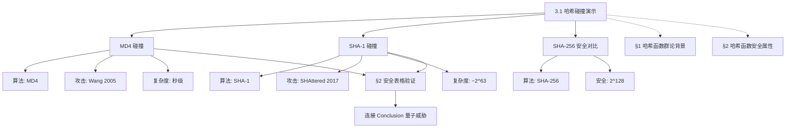

# 3.1 哈希碰撞知识图谱（可视化版）

> **创建时间**: 2026-07-14
> **关联**: [[3.1-哈希碰撞知识图谱]]

---

## 知识图谱总览



---

## MD4 碰撞节点

### 基本信息
- **算法**: MD4 (Rivest, 1990)
- **输出**: 128-bit
- **轮数**: 3 轮，每轮 16 步
- **攻击**: 差分攻击 (Wang et al., 2005)

### 攻击原理
```
差分路径控制
├── 分析消息差异在压缩函数中的传播
├── 引导消息差异相互抵消
└── 构造碰撞对
```

### 安全弱点
- 轮数少（仅 3 轮）
- 非线性函数简单
- 差分路径容易构造

### 碰撞结果
- 两个视觉上完全不同的输入
- MD4 哈希值完全相同
- 碰撞成立（几秒钟）

### 群论视角
- 不基于群结构
- Merkle-Damgård 迭代构造
- 压缩函数使用模加和位运算
- 安全来自混淆与扩散，而非群困难问题

---

## SHA-1 碰撞节点

### 基本信息
- **算法**: SHA-1 (NIST, 1995)
- **输出**: 160-bit
- **轮数**: 80 轮
- **攻击**: SHAttered (Google + CWI, 2017)

### 攻击复杂度
- ~$2^{63}$ 次 SHA-1 计算
- 等价于 ~110 GPU-年

### 碰撞结果
- 两个不同 PDF 的 SHA-1 值相同
- Google 实际生成碰撞并公开

### 与 MD4 对比
| 属性 | MD4 | SHA-1 |
|---|---|---|
| 输出长度 | 128-bit | 160-bit |
| 轮数 | 3 轮 | 80 轮 |
| 碰撞复杂度 | 秒级 | ~$2^{63}$ |
| 攻击难度 | 简单 | 较复杂但仍可行 |

### 对 Git 的影响
- Git 使用 SHA-1 标识提交
- 理论上有风险
- 实践中被利用极难（需要匹配 Git 对象格式）

---

## SHA-256 安全节点

### 基本信息
- **算法**: SHA-256
- **输出**: 256-bit
- **轮数**: 64 轮

### 抵抗原因
1. **消息扩展**: 16 blocks → 64 words，放大微小差异
2. **非线性函数**: $\Sigma_0, \Sigma_1, \sigma_0, \sigma_1, \mathrm{Maj}, \mathrm{Ch}$ 混合更充分
3. **轮数**: 更多、设计更复杂

### 碰撞复杂度
- 经典：~$2^{128}$（生日攻击）
- 量子：~$2^{85}$（Grover）

### 安全状态
- 当前安全下限
- 实际碰撞攻击不可行

---

## 实验对比表

| 哈希函数 | 输出长度 | 经典碰撞复杂度 | 量子碰撞复杂度 | 安全状态 |
|---|---|---|---|---|
| MD4 | 128-bit | $O(2^{10})$（秒级） | — | 已破 |
| SHA-1 | 160-bit | $O(2^{63})$（~110 GPU-年） | $O(2^{32})$（Grover） | 已破 |
| SHA-256 | 256-bit | $O(2^{128})$ | $O(2^{85})$ | 安全 |

---

## 时间复杂度对比

| 哈希函数 | 每块时间复杂度 |
|---|---|
| MD5 | $O(1)$（64 步） |
| SHA-1 | $O(1)$（80 步） |
| SHA-256 | $O(1)$（64 步） |

注：所有哈希函数都是 $O(n)$（线性于输入长度），每块操作次数固定。

---

## 知识图谱连接

### 与 §1 的连接
- **§1.2.2**: 哈希函数群论背景（GTIC p8）
- **§1.2.3**: 哈希函数安全属性（AOGTICA p5）

### 与 §2 的连接
- **§2.2 安全表格**: MD5 $2^{39}$, SHA-1 $2^{63}$, SHA-256 $2^{128}$
- **验证**: 实验中实际产生了碰撞 → 验证理论边界

### 与 Conclusion 的连接
- **经典攻击**: MD4/SHA-1 碰撞展示经典计算攻击
- **量子威胁**: 即使是正确参数的哈希函数，Grover 算法也能加速碰撞查找
- **后量子密码**: 自然引出哈希签名等后量子方案

---

## 写作要点

### 3.1.1 MD4 碰撞
1. **设置**: MD4（128-bit，3 轮），Wang et al. 差分攻击
2. **结果**: 碰撞成立，两个输入 MD4 哈希值相同
3. **分析**: 差分路径控制、轮数少、非线性函数简单
4. **过渡**: "MD4 的脆弱性让密码学家设计了更强的 MD5。但 MD5 也被破解了。"

### 3.1.2 SHA-1 碰撞
1. **设置**: SHA-1（160-bit，80 轮），SHAttered 攻击
2. **结果**: 碰撞存在，两个 PDF SHA-1 值相同
3. **分析**: SHA-1 比 MD4 更难但终究被碰、对 Git 的影响
4. **过渡**: "哈希碰撞展示了算法设计缺陷的后果。类似的原理也适用于非对称密码。"

---

## 参考文献

| 文献 | 年份 | 贡献 |
|---|---|---|
| Wang et al. (2005) | 2005 | MD4 碰撞攻击 |
| SHAttered (Google, 2017) | 2017 | SHA-1 碰撞攻击 |
| GTIC p8 | 2009 | 哈希函数群论背景 |
| AOGTICA p5 | — | 哈希函数安全属性 |

---

## 相关文档

- [[3.1-哈希碰撞知识图谱]]: 详细知识总结
- [[01-加密算法群结构分类分析]]: 哈希函数分类
- [[02-密码算法实现与群理论解释]]: 哈希函数实现
- [[GTIC-注释翻译]]: p8 哈希函数群论背景
- [[Section2-大纲]]: §2.2 安全表格
