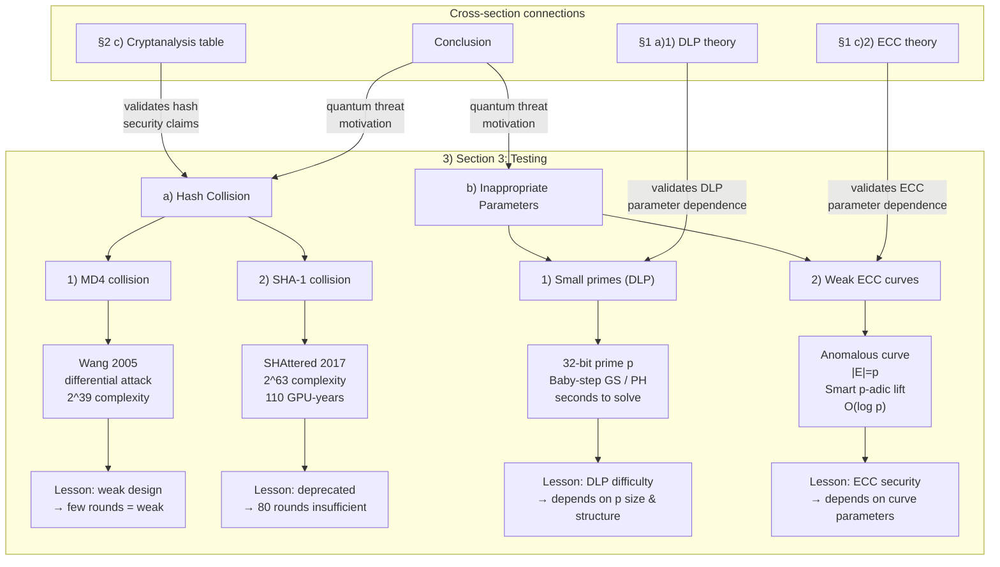

# Section 3: Testing of Algorithms (~600 words)

> 编号对应 `Main Structure.md`：3) a) Hash Collision → b) Inappropriate Parameters。
> 完整参考见 [[Section3-参考]]。

---

## 知识图谱



---

## 大纲结构

```
3)  Section 3: Testing of Algorithms (~600 words)

    a)  Hash Collision in Weak MD4 and SHA-1

        1)  MD4 collision

            MD4 collision via Wang et al. (2005) differential attack at ~2^39 complexity.
            (Wang et al. 2005, Eurocrypt — [iacr.org](https://iacr.org/archive/eurocrypt2005/34940001/34940001.pdf))

        2)  SHA-1 collision

            First practical SHA-1 collision at ~2^63 complexity (~110 GPU-years),
            two different PDFs with identical hash.
            (SHAttered 2017, Google & CWI — [shattered.io](https://shattered.io/static/shattered.pdf))

    b)  Use Inappropriate Parameters to Test Asymmetric Ciphers

        1)  Small primes (DLP)

            DLP on a 32-bit prime group solved in seconds via baby-step giant-step
            or Pohlig–Hellman decomposition. Demonstrates that DLP difficulty depends
            on the size and structure of the group.
            (See HAC Ch.3 — [cacr.uwaterloo.ca](https://cacr.uwaterloo.ca/hac/about/chap3.pdf))

        2)  Weak ECC curves (anomalous)

            Anomalous curves ($|E(\mathbb{F}_p)| = p$) allow ECDLP to be solved in
            $O(\log p)$ time via Smart's $p$-adic lift.
            ([doi:10.1007/s001459900052](https://doi.org/10.1007/s001459900052))
            Demonstrates that ECC security depends on correct curve parameter selection.
```

---

## 段落缝合

- a) → b)：*"Hash collisions demonstrate the consequences of design flaws. A similar principle applies to asymmetric ciphers—incorrect parameter choices can render a mathematically sound algorithm insecure."*
- b) → Conclusion：*"All experiments above demonstrate classical attacks. Under quantum threats, even correctly parameterized RSA, DH, DSA, and ECC become insecure—leading us to the need for post-quantum cryptography."*

---

## 与正篇的连接

| 实验 | 连接 |
|:---|:---|
| a) 哈希碰撞 | → 验证 §2 c) 安全表中 MD5/SHA-1 的"已破"声明 |
| b)1) 小素数 DLP | → 验证 §1 a)1) DLP 理论：群大小决定难度 |
| b)2) 弱 ECC 曲线 | → 验证 §1 c)2) ECC 理论：参数选择重要 |
| a)+b) | → 引到 Conclusion：量子威胁 = 即使正确参数也不安全 |

---

## 文件索引

| 文件 | 内容 |
|:---|:---|
| [[Section3-大纲]] | 本章（本文件）|
| [[Section3-参考]] | 完整参考：全部 4 个子项的概念、数据、算法、引用 |
| [[密码算法群结构分析/03-研究报告/Section-3-Testing/3-1-Hash-Collisions/参考]] | 3.1 分节参考：MD4 & SHA-1 碰撞、差分攻击 |
| [[密码算法群结构分析/03-研究报告/Section-3-Testing/3-2-Improper-Parameters/参考]] | 3.2 分节参考：小素数 DLP、异常曲线攻击 |
